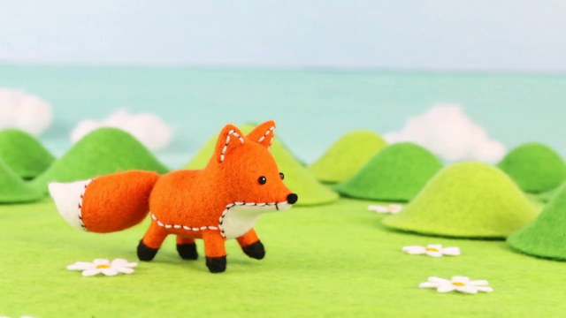
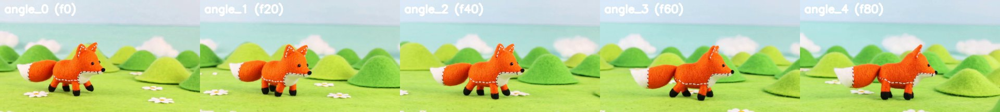

# Character and set consistency

How we keep the same character and the same place across many shots, and how
every image in that process is produced. Worked example: the felt fox,
configured in `character/characters/fox.yaml`, run by `character/character.py`.

## Why characters drift

A video model draws each shot from scratch. With text alone, "a small orange
felt fox" is a *description*, and every shot samples a different fox that fits
it: another shade of orange, other ears, another hill behind him. Within one
shot the model holds a character well (our first fox shot stayed consistent
for all 5 seconds); the drift happens **between** shots, because nothing ties
them together but the words.

## Three techniques that stack

They are not alternatives. Each one feeds the next:

| | Technique | What it fixes | Cost |
|---|---|---|---|
| 1 | **Sheets**: one fixed description of the character and of the set, pasted verbatim into every prompt | narrows the drift | free |
| 2 | **Anchors**: every shot *starts from a real image* of the character (Wan image-to-video) | identity is exact at frame 0 and holds for the shot | one GPU job per shot |
| 3 | **LoRA**: a small fine-tune that teaches the model *this* character | the model knows him in any pose, even without an anchor | a few GPU-hours, once |

Step 1 is inside every prompt of step 2. Step 2 produces the stills that step 3
trains on. So the pipeline is: **sheets → canonical still → more angles →
shots → (later) LoRA dataset**.

## The pipeline, stage by stage

Run from the channel folder (`/scratch/project_465002727/jelealro`):

```bash
W=twc_video/lumi/run_in_container.sh
$W python twc_video/character/character.py prompt      # show the assembled prompts
$W python twc_video/character/character.py canonical   # CPU, seconds
#  orbit and shots need a GPU: submit them through lumi/run_tasks.sbatch
$W python twc_video/character/character.py angles      # CPU, seconds
$W python twc_video/character/character.py dataset     # CPU, seconds
```

Outputs go to `work/characters/<name>/`. **Every image and clip gets a `.json`
sidecar** with the exact prompt, seed, source image and settings that made it,
so any result can be traced and reproduced.

### 1. The sheets (text)

In `fox.yaml`: `character`, `set`, `style` and `negative`. Every prompt is
assembled as

> *action* + "The fox is" *character* + "The scene is" *set* + *style*

Rules that matter:
- **Name what must not change**: the distinctive details (white stitching on
  the ears, black legs, white tail tip). Vague sheets drift more.
- **Keep the sheet frozen.** Change the *action*, never the sheet. Rewording it
  is how a second fox sneaks in.
- **One slow action per shot.** Measured: "the fox walks" held identity for 5 s;
  "the bunny hops three times" made the bunny teleport around the frame. Fast,
  repeated actions break the model's hold on the character.

### 2a. The canonical still: the one image that defines the character

We don't need an image generator: the best frame of a shot we already liked
*is* the canonical character. `canonical` scans a window of frames in the
source clip and keeps the **sharpest** (highest variance of the Laplacian,
which means least motion blur and crispest stitching).

For the fox: frame 28 of the first felt test shot.



What makes a good canonical still: the whole character in frame, a
three-quarter view (both eyes and the side profile readable), every feature
from the sheet visible, neutral pose, and the set clearly behind him.

### 2b. More camera angles: the orbit

One still gives one camera angle, but shots need others. So the first shot is
not a story shot at all: it is an **orbit**. Wan starts from the canonical
still and the prompt says *"the camera slowly orbits in a half circle around
the fox, which stands still…"*. Because the clip starts from the real fox, the
fox is identical at frame 0, and as the camera circles he stays the same fox
seen from new sides.

`angles` then keeps frames `[0, 20, 40, 60, 80]` of the orbit as keyframes
(`angles/angle_0.png` … `angle_4.png`) plus a `contact_sheet.png` to choose
from. The same trick works for a **location**: orbit the empty set once and
you have the background from several angles.

**What actually happened (first run):** identity held perfectly: same fox,
same stitching, same set in all five keyframes. But the camera barely moved:
about 30°, from three-quarter view to near profile, not a half circle.



Lessons:
- From a still, Wan is **conservative with large camera moves** in a 5 s clip.
- To get front and back views, **turn the character, not the camera**: *"the fox
  slowly turns around to face the camera"* is a smaller, more natural motion.
- Orbits **chain**: start the next orbit from `angle_4` to keep going round.
- The model may also move the fox instead of the camera, or let him walk off;
  the prompt says he does not walk and the negative prompt lists "fox walking,
  fox leaving the frame". Always check the contact sheet before using an angle.

### 2c. Shots

Each shot names the keyframe it starts from (`from: angle_1`) and **one slow
action**. The prompt is the action plus the frozen sheets. Every shot therefore
opens on the real fox, from the angle that suits it, in the same set.

### 3. LoRA (later)

Once the design is final, `dataset` collects the canonical still, the angles
and every 8th frame of the shots, each with a caption that starts with the
trigger word (`twcfox, a small orange felt fox …`). That folder is the training
set for a character LoRA. After training, a prompt containing `twcfox` draws
this fox without needing an anchor image, which frees the camera completely.

Open-source trainers support Wan 2.2 LoRAs (for example DiffSynth-Studio and
musubi-tuner); pick one and check its licence before training. Do this only
after the character design is settled: a LoRA bakes in whatever it is shown.

## Costs (one MI250X GCD on LUMI, 720p, 40 steps)

| Stage | Time |
|---|---|
| canonical, angles, dataset | seconds, CPU |
| model load (fp32 weights converted to bf16) | 10–20 min per job |
| one 81-frame (5 s) orbit or shot | ~2 h |

Shots are independent, so they run in parallel: `lumi/run_tasks.sbatch` puts
up to ~4 on one node (host RAM is the limit, ~80–100 GB each).

## Results log

- 2026-09-25: canonical still chosen (frame 28, sharpness 15.9).
- 2026-09-25: orbit done (seed 501, ~2 h 05 min at 40 steps). Identity perfect across
  all five keyframes; angle change only ~30°. Shots `fox_sits` (from `angle_1`) and
  `fox_looks_up` (from `angle_3`) submitted.
