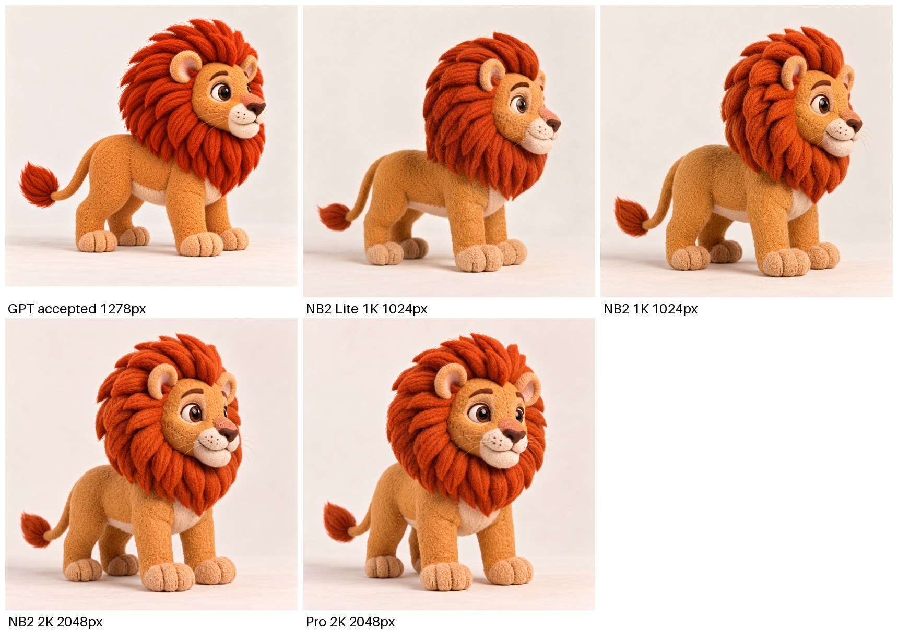
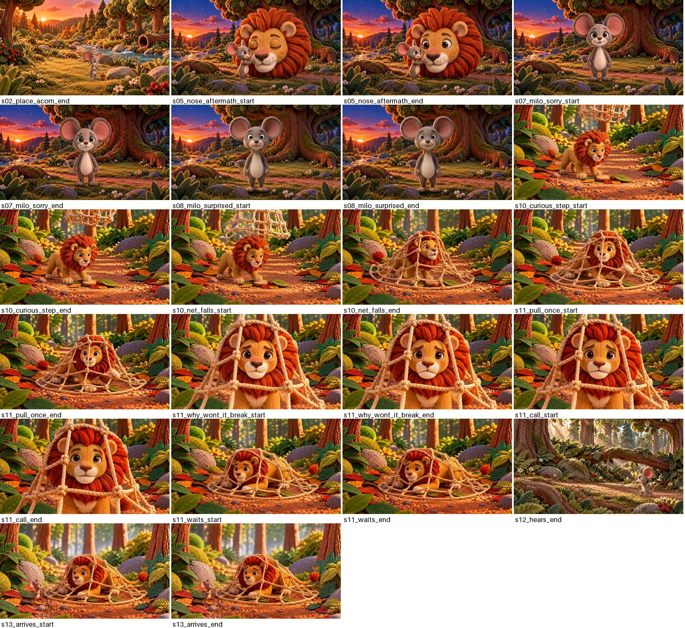
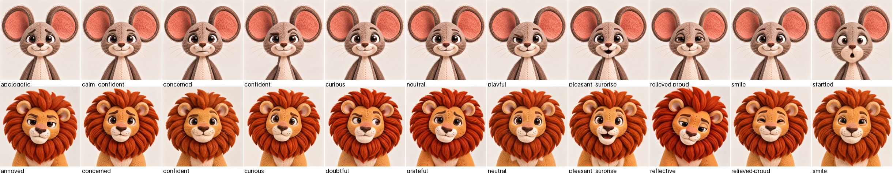
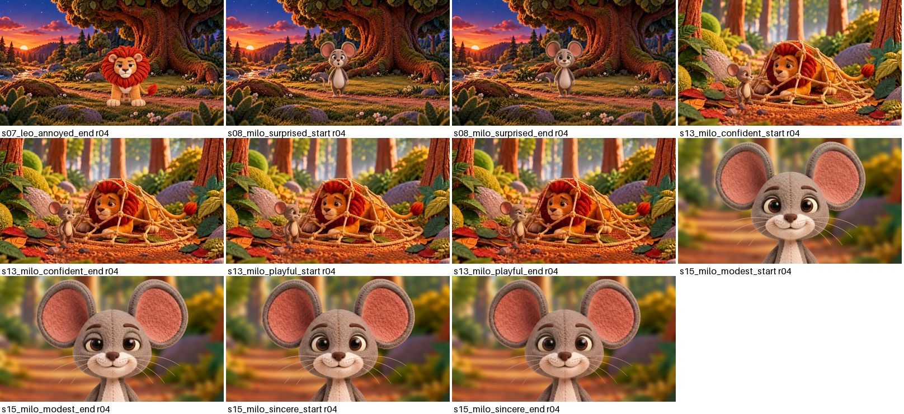
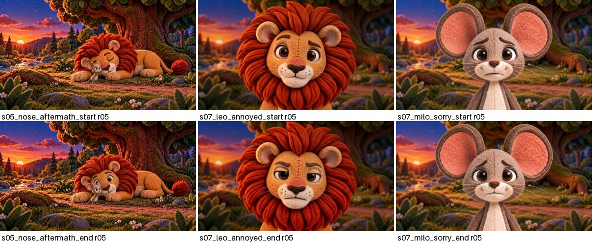

# Gemini image generation for v4 (replacing GPT)

Since 2026-10-02, v4 stills are made with the Gemini API instead of GPT's
built-in image tool (owner decision: keep creating in Gemini and spend as
little as the quality allows). One script does everything:
`character/gemini_image.py`. It reads the same prompt records GPT used
(`stories/lion_and_mouse_v4/prompt_manifest.json`), so the documentation
chain is unchanged: record → candidates → visual review → accepted target +
manifest result.

**Status (2026-10-02, latest):** the owner now creates the v4 images
personally; agents run this workflow only when the owner asks. It produced
r02 to r05 and the 22 expression studies. After r05 a few in-place repairs
were made again with GPT's built-in image tool (S07 Milo muzzle, S08 close-ups,
S06/S08 kindness Leo scale); see
`stories/lion_and_mouse_v4/GENERATION_PROGRESS.md`.

## Setup

- Python 3 with Pillow (`pip install pillow`); the API calls use the standard library only.
- Key: `GEMINI_API_KEY` in the environment (never print or commit it). In
  the Claude Code cloud container, leave it unset: the egress proxy injects it.
- Check access: `python3 character/gemini_image.py models` lists the image
  models the key can use.
- Billing: the Gemini project has a **monthly spending cap** (AI Studio →
  Spend). When it is reached, every call returns HTTP 429 `RESOURCE_EXHAUSTED`
  ("exceeded its monthly spending cap") and the script stops.

## Workflow (from 2026-10-02: prompts are rendered templates, CR-18)

```bash
python3 production/image_prompts.py build && python3 production/image_prompts.py lint   # 0 errors first
G="python3 character/gemini_image.py"
R=rNN                                                              # revision tag: names the candidates and the accepted file
$G gen --record s14_gnaw_fray_start --revision $R --dry-run        # print references, model and the text to be sent
$G gen --record s14_gnaw_fray_start --revision $R --takes 3        # candidates
$G sheet --record s14_gnaw_fray_start --revision $R                # identity roots + current target + candidates -> work/review/gemini_sheet.jpg
$G ledger                                                          # images and estimated cost per model
$G accept s14_gnaw_fray_start_${R}_nb2_t02 --note "what you checked at full size"
```

`--revision` is required: the candidate names and the accepted file name come from it.

1. **Corrections go into the prompt record, not into a side file.** An owner note becomes
   positive, specific text in the record's `prompt_template` or `frame`, or in the bible when it
   concerns a character, place or size; then `build` and `lint`. `gen` sends exactly the rendered
   `positive_prompt` and appends nothing, and it refuses to run while lint has errors. The r02 to
   r05 passes used appended fix files (`revisions/r02.json` to `r05.json`, with
   `extra_references`/`drop_references`); they are kept as history only
   (`revisions/README.md`), and their accepted corrections are folded into the templates.
2. **References.** The record's `ordered_references` are sent in order, each image preceded by its
   number; the prompt's own reference list (`{{refs}}`) says what each one is for. An id that is
   itself a manifest record resolves to that record's *current* target. So after you accept a new
   start frame, its end frame (role `edit_base`) automatically gets the new start. Work in
   dependency order: start → accept → end → accept → next shot.
3. **Candidates** go to `<target dir>/gemini/<stem>_<rev>_<model>_tNN.png`
   with a `.json` sidecar: references and hashes, model, the full prompt sent,
   usage, raw size, retries. These folders are git-ignored.
4. **Review** every candidate: the contact sheet first (its first columns are the record's identity roots, so a drifting face shows side by side), then full-size crops
   of faces, paws, legs and contacts (the checks in `docs/creation-rules.md`
   CR-11/CR-12 and the record's `acceptance` list).
5. **Accept** copies the take to `<stem>_<rev>.png` and updates the manifest:
   `revision`, `target`, `status: accepted` and a `result` holding the prompt,
   references, model and your note. Review status is
   `accepted_pending_owner_review`, and the previous result moves to
   `superseded`. The owner's verdict comes after. `accept` does not delete
   the previous file; superseded files are pruned after owner review, so each
   record keeps one active file (CR-17).

Output is normalised to the record canvas: centre-cropped to its aspect
(Gemini's 16:9 at 1K is 1376×768) and resized to 1920×1080 or 1536×1536, as
was done for the GPT takes (1254 → 1536).

## Which model (measured 2026-10-02)

| Model (id) | ~USD/image (1K) | Use for |
|---|---|---|
| Nano Banana 2 Lite (`gemini-3.1-flash-lite-image`) | 0.034 | Square studio references (one character, plain backdrop). Matched the GPT `L_SIDE_R` side view. **Default for 1:1 records.** |
| Nano Banana 2 (`gemini-3.1-flash-image`) | ~0.045–0.067 | **Default for 16:9 scene keyframes.** Kept plates, cast and the V3 staging well. |
| Nano Banana Pro (`gemini-3-pro-image`) | 0.134 | Escalation only. Best Leo face and mane on one hard frame (`s10_curious_step_start`), but another take replaced the whole plate. |

Prices come from third-party summaries of Google's 2026 list
(ai.google.dev is blocked in the cloud container); check them against
billing. The first r02 batch made 74 images for about $5 estimated.



Why Lite is not used for scenes: on `s02_place_acorn_end` both Lite takes
enlarged Milo from 0.30 to about 0.55 of the frame, ignoring the start frame.
NB2 kept the scale once the prompt stated it in frame fractions.

## Lessons from the r02 run (apply them in every fix)

- **State scale in frame fractions.** "Same size as reference image 1" is not
  enough: write "from ear tips to feet he spans y=0.55 to y=0.87 (about 0.3
  of the frame), centred near x=0.55". For a pair, measure the accepted start.
  For two characters, say what Milo is as big as ("his head is smaller than
  Leo's muzzle").
- **V3 staging leaks V3 identity.** With V3 net images as references, NB2
  drew Leo's mane red and short. Fix: say the V3 images are staging only and
  describe the canonical mane colour and volume explicitly. This text is in
  every trap record of `revisions/r02.json`.
- **Spell out small props.** The trigger came back as a disc with an "X"
  until the fix said "a small plain round felt disc with no markings, half
  hidden under leaves".
- **Expressions drift to a smile.** NB2 smiles by default. Name the brows,
  eyes and mouth ("brows high, eyes wide, mouth closed in a small neutral
  line, no smile").
- **Full-body Milo instead of pasted portraits.** The owner rejected cropped
  Milo heads as pasted cutouts. The r02 fix asks for a cohesive full-body
  medium shot, lit like the plate, with a contact shadow. When Leo is in the
  same shot, state the depth so Milo stays at one third of Leo's height.
- **Empty answers are random.** Gemini sometimes answers with no image
  (`PROHIBITED_CONTENT` on Leo, or a bare `STOP`). One `s08` request failed 7
  of 15 times, and another Leo request was blocked 3 times and then passed.
  The script retries (`--retries 4`); a blocked call bills only its input
  tokens. 503 "high demand" also happens; the script retries it after a
  longer wait.
- The negative prompt is not sent (the API has no negative field). The
  record's exclusions are review criteria, as with Fast Lightning.

## Status of the v4 image records

**Current (2026-10-02, after r05 and the in-place repairs):** the manifest has
140 image records, the 118 planned ones plus the 22 expression studies. 139
are `accepted` with their file on disk; `s02_place_acorn_end` is
`missing_after_owner_review` (the owner deleted its r02 and later attempts
were rejected; the `s02_place_acorn_end_r01.png` left on disk is the rejected
r01). Record revisions: r01 94, r02 30, r04 10, r05 6. 63 records still read
`accepted_pending_owner_review`; the owner reviews them directly.

**After r03 (history, earlier on 2026-10-02):** all 118 image records in the
manifest were `accepted` (74 at r01 from GPT, 40 at r02 and 4 at r03 from
Gemini), pending the owner's review. r03 redid
the owner's second-round rejections: s05 (Leo had no body, now made with
Pro and anchored on the previous shot) and s08 (Milo's face was off-model,
now an edit of the approved s07 frame). The four S15 Leo close-ups stay r01:
they show no net and were not rejected.



### Images made and cost

From `stories/lion_and_mouse_v4/revisions/gemini_ledger.csv` (`python3 character/gemini_image.py ledger`, run after r05 on 2026-10-02). The first 84 rows were reconstructed from the session log (marked `reconstructed`); later rows are written by the tool for every call. (Before r05 the totals were 200 images and about $12.92.)

| Model | Size | Images | Failed takes | ~USD/image | ~USD total |
|---|---|---|---|---|---|
| gemini-3-pro-image | 1K | 8 | 0 | 0.134 | 1.07 |
| gemini-3-pro-image | 2K | 1 | 0 | 0.134 | 0.13 |
| gemini-3-pro-image-preview | 2K | 3 | 0 | 0.134 | 0.40 |
| gemini-3.1-flash-image | 1K | 161 | 0 | 0.067 | 10.79 |
| gemini-3.1-flash-image | 2K | 1 | 0 | 0.101 | 0.10 |
| gemini-3.1-flash-lite-image | 1K | 40 | 1 | 0.034 | 1.36 |
| **total** | | **214** | 1 | | **13.86** |

Prices are estimates per output image; the Google bill also includes voice and the input tokens of calls that returned no image.

### Rules learnt

The generated-image gates in `docs/creation-rules.md` **CR-13** (whole bodies,
side-by-side identity check, reuse of approved same-setup frames, scale as
fractions, staging-only references, props, expressions, continuity cascades,
plate checks, ledger) came out of this pass and apply to every future image.

## r04 and expression references (2026-10-02)

The owner's third review asked for a smaller Milo in s08 and s13 (the size
in s14 opening or milo-clear), S15 Milo in the `s15_leo_reflects` close-up
format, an expression set like V3, and a fix for a doubled brow in
`s07_leo_annoyed_end`. Fixes are in `revisions/r04.json`; the measured size
guide and the close-up format are now `docs/creation-rules.md` **CR-14**.

**Expression references** (22 records, group `expressions`, Lite, about
$0.03 each): `character/characters/lion_and_mouse_v4/{Milo,Leo}/expressions/`. Each one is
an edit of the V4 closed-mouth portrait that takes only the expression from
the V3 image of the same name. Six needed a retake: three Milo faces still
smiled and three Leo backgrounds turned into a room or floor.



r04 frames (s07 Leo end, s08 pair, s13 Milo four, S15 Milo four):



## r05 and the framing rule (2026-10-02)

The owner asked for s07 as a first-meeting dialogue in the S15 close-up style. That became `docs/creation-rules.md` **CR-15**: a `framing` field on every scene record and a step-by-step close-up recipe. s05's Milo face was redrawn in three-quarter view; the first s05 end edit drew two Milos, which led to the "edits must not add characters" rule.

r05 was the last Gemini pass. What followed (in-place repairs with GPT's built-in image tool, the deleted S02 end, open S13 framing/size questions) is in `stories/lion_and_mouse_v4/GENERATION_PROGRESS.md` and the v4 README's "Open issues".


