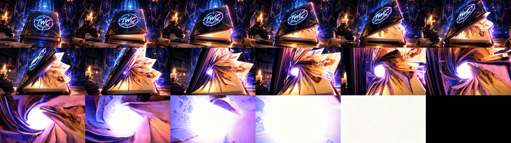
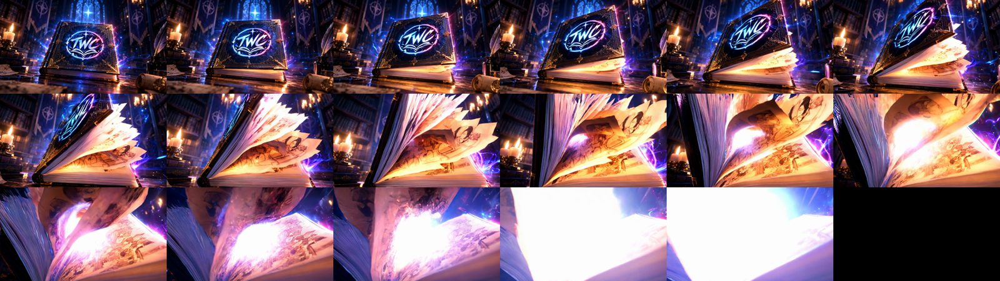

# The channel intro: how it evolved and how it is made now

A 10-second ident for The Webtoons Corner. Inputs: the approved stills in
`Intro/reference_img/` (`1.png` … `6.png`), the emblem `watermark_big.png`.

## What was tried, and what it taught

| Version | Approach | Lesson |
|---|---|---|
| LTX v3, 2B, preview | 5 transitions, each pinned to a start and end still | 25–33 frames per clip is too few: the model jumps to the end still in 3 frames and holds |
| LTX iterations 1–10 | more frames, 13B model, 720p, per-segment seeds, re-timed soundtrack | frames and model size fix the snap; long clips (73–97 f) make state changes hold then wipe |
| Wan 2.2 chain | same 5 transitions with Wan I2V-A14B (first + last frame) | clearly better motion: the cover hinges open for real |
| Wan story | only stills 1, 5, 6; the middle described in text | fewer forced stills read as one continuous shot |
| post chain | RIFE (16→30 fps) + Real-ESRGAN + grade instead of ffmpeg minterpolate + lanczos | resolves detail lanczos lost; keep grading as a separate cheap pass |
| procedural | every frame drawn by code (`procedural/twc_ident.py`) | the logo and wordmark are pixel-exact, which diffusion never managed |
| **hybrid** | Wan journey, then the procedural reveal, joined inside a white flash | **the best of both; the favourite** |

## Current approach: intro v4

1. **Wan I2V from `1.png` only** (`intro/intro_v4.py generate`), the journey
   described in text and ending in a white burst. Two variants: `white` forces
   the end with a white end frame, `open` relies on the prompt.
2. **Post**: RIFE + Real-ESRGAN, retimed so the white-out lands at the chosen
   hit time (`twc/post.py`).
3. **Reveal**: `procedural/twc_ident.py --hit T` and `audio/make_music.py
   --impact-at T`, both timed from the same hit.
4. **Cut**: `intro/hybrid_cut.py --cut T`, joined inside white (the Wan side is
   ramped to full white over 0.17 s so luma is continuous across the join).

Changing where the logo lands is one number, `T`, plus a two-minute CPU
re-render.

## Intro v4 results (2026-09-25)

Both clips: `1.png` + the same journey prompt, seed 20260925, 81 frames, 40 steps.

**`white`** (end frame forced to a white card): the cover opens, pages erupt, a
real **vortex of pages** forms with light at its eye, the camera dives into it,
and the clip ends in true white (peak luma 251, white-out at 4.75 s). It did
*not* wash out early: the white arrives only in the last half second.

**`open`** (first frame only): cover lifts, pages fan, camera pushes into the
glowing centre, ends near white (peak luma 233 at 4.94 s). Less vortex energy.

Finished files: `Intro/Intro_channel_video_v4_white.mov` and `…_v4_open.mov`
(logo lands at 6.0 s, ~4 s on screen). Verified: 300 frames, no repeated frames,
luma continuous through the cut (white: 248 251 254 | 255 252 237).

Two fixes made on the way, both also applied to the earlier hybrid:
- the procedural flash is now applied after the vignette, so its first frame is
  full-frame white (it had grey edges, mean luma 206 after a 254 Wan frame);
- the hybrid cut now forces an exact 30 fps grid; before, a silent 25 fps
  fallback made the whole video judder (one repeated frame in six).

Lesson: **giving the model a destination helps**. An end frame of pure white made
it build toward the flash instead of drifting, and produced the most energetic
journey of any version.
