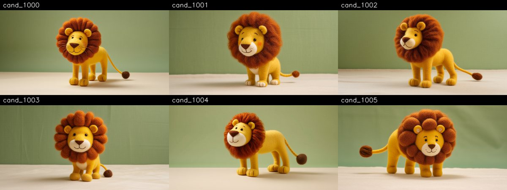
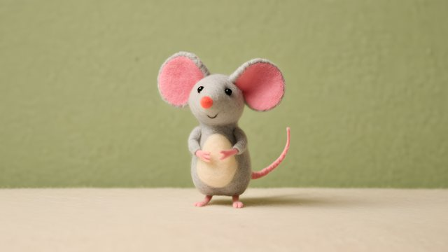
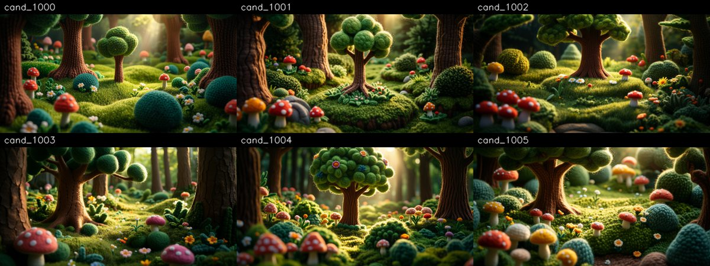
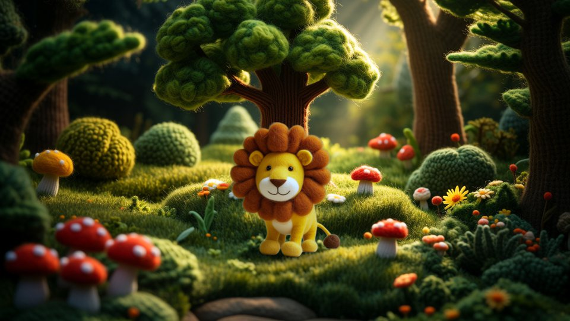
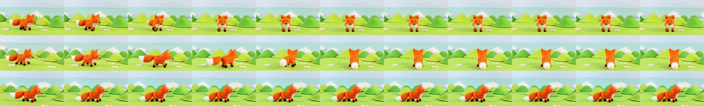
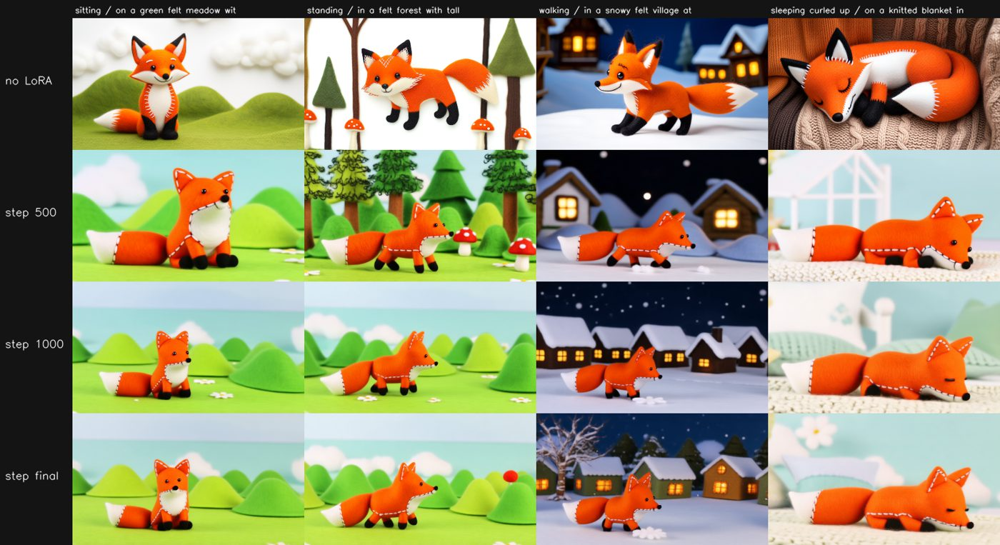

# Producing a felt-animal fable: the complete guide

How to go from a story idea to a finished, consistent, monetisable children's
video with this repo. Worked example throughout: **The Lion and the Mouse**
(`stories/lion_and_mouse/story.yaml`). Narration, voices and sound are done
outside this repo (ElevenLabs); here we make the pictures, plus optional
background ambience.

## 0. What "professional" means here

A children's fable works when a child can follow it without effort: the same
characters, in recognisable places, doing one clear thing at a time, towards a
kind message. Every technical rule below serves that.

It is also what the platform pays for. YouTube's **quality principles for
kids and family content** reward videos that model *"Looking after yourself
and others"* (kindness, good friendship) and *"Creativity, play, and a sense of
imagination"* (storytelling), and demote content that is *"Hard to follow"*
(jumbled storylines) or *"Sensational or misleading"* ([YouTube Help][yt-kids]).
Channels with a strong focus on low-quality made-for-kids content can be
suspended from the Partner Program ([YouTube Blog][yt-kids-blog]).

Separately, YouTube's **inauthentic-content policy** (renamed from
"repetitious content" in July 2025, clarified in July 2026) removes
monetisation from *"generic, repetitive, or template-based"* videos made with
minimal variation using AI, from *"off-putting or distressing"* content, and
from AI personas on sensitive topics ([TechCrunch][tc-2026], [Tubefilter][tf-2026]).
YouTube's own example of distressing content is **animals in distress followed
by a rescue**, which is the shape of many fables. AI assistance itself is
fine when it *"enhances creativity"* and the result is high quality.

What this means in practice:

| Rule | Why |
|---|---|
| Every story is original in its telling: your script, your direction, your characters | template-made, look-alike videos are what the inauthentic-content policy targets |
| Characters never change appearance between shots | inconsistency makes a story "hard to follow" |
| Peril is brief, mild and resolved kindly; never the thumbnail | "animals in distress then rescue" is YouTube's own example of distressing content |
| No logos, brands, products, recognisable third-party characters | "heavily promotional", "strange use of children's characters" |
| Mark the videos *Made for kids* | required for child-directed content (it disables personalised ads and comments) |

**AI disclosure.** YouTube requires the *altered or synthetic content* label only
for *realistic* content that could be mistaken for a real person, place or
event; clearly unrealistic or animated content is exempt ([YouTube Blog][yt-ai]).
Felt stop-motion animals are clearly unrealistic, so the label is not required;
a line in the description ("Animated with the help of AI tools") is honest and
costs nothing.

## 1. The pipeline at a glance

```
story.yaml ──► design ──► characters ──► locations ──► shot plan ──► render ──► post ──► edit
 (bible)      (stills)   (canonical,    (plates)      (one action   (Wan I2V   (RIFE,    (ElevenLabs
                          turnarounds,                 per shot)     from key-  ESRGAN,   narration,
                          LoRA)                                      frames)    grade)    music, cut)
```

| Stage | Tool | Output |
|---|---|---|
| Story bible | `stories/<slug>/story.yaml` | style, characters, locations, scenes: the only place story facts live |
| Design | `production/design.py candidates / sheet / pick` | candidate stills; the chosen **canonical** still per character and location |
| Character pack | `character/character.py` (turns, angles, dataset) | a pose/angle library, and the LoRA dataset |
| LoRA | `lora/` (musubi-tuner) | a small model per main character |
| Shots | Wan 2.2 image-to-video from keyframes | 5 s clips, one action each |
| Post | `twc/post.py` | 1080p30, learned interpolation and upscaling, grade |
| Edit | your editor + ElevenLabs | the finished episode |

## 2. The story bible (`story.yaml`)

Everything the story needs is written once, here, and pasted verbatim by the
tools into every prompt:

- **style** and **negative**: the look of the whole film. Never change them
  mid-story.
- **characters**: a frozen **sheet** each (the exact description), a trigger
  word for the LoRA, personality, and relative **scale** (Milo is 1/6 of Leo).
- **locations**: a sheet each; every shot set there starts from the same plate.
- **scenes**: the author's text, then the shot breakdown.

Writing a character sheet:
- Name the details that must never change: colours, materials, eye style, the
  one distinctive feature (Leo's burnt-orange mane, Milo's oversized pink ears).
- Materials, not photographic words: "needle-felted", "stitched", "wool".
- One sheet per character, frozen. Change the *action*, never the sheet.

## 3. Design: characters and places as stills

Before anything moves, every character and location gets **one canonical
still**. Everything later starts from it.

```bash
W=twc_video/lumi/run_in_container.sh
$W python twc_video/production/design.py prompt                     # see the prompts
# GPU: design.py candidates -n 6                                    # ~2.5 min per still
$W python twc_video/production/design.py pick --entities leo --seed 1003
$W python twc_video/production/design.py reframe --entities milo    # small characters
```

**Same model for design and animation.** The candidates are drawn by Wan 2.2
itself (a one-frame video), so the character that gets animated is exactly
the one that was designed. A different image model would introduce a second
interpretation of the sheet.

**Characters are shot as model sheets**: whole body, three-quarter view,
neutral pose, alone on a plain felt backdrop. The plain backdrop is not an
aesthetic choice; it is what lets the character be cut out cleanly later.



**How to pick.** The chosen still must agree with its own text sheet, because
the sheet is pasted into every prompt forever after. For Leo, 1003 was picked
over the more striking 1005 (a mane of felt balls): the sheet says "large
fluffy mane", and a canonical that contradicts its sheet gets pulled back
towards the text in every shot. If you prefer a candidate that contradicts the
sheet, rewrite the sheet to match it; never keep both.

What the model does not follow: it drew Leo's eyes black in all six
candidates although the sheet says "warm brown stitched eyes", and it added a
cream muzzle nobody asked for. Decide once whether to accept such changes (and
edit the sheet) or to keep asking for them.

**Small characters get reframed.** Milo is correctly tiny in his design shot,
but that leaves too few pixels to animate or to train on. `reframe` crops
around him (the box comes from the matting model), keeps 16:9, and upscales
with Real-ESRGAN back to 1280x720. It asserts that the character is inside the
crop and fills a sensible share of it; the first, unchecked version produced
an image of empty floor, and nothing downstream would have noticed.



**Locations are empty plates**: the set with no characters, the centre left
open as a stage. Pick for the story's needs, not for beauty alone: for Scene 1
the clearing needs morning light and open grass in front of the tree where Leo
can sleep.



**Say that the place fills the frame.** With "an empty miniature set", half of
the berry-patch candidates came out as isolated props on a studio table, not
as a place. The location prompt now says the scene fills the frame edge to
edge, with no backdrop and no table.

Picks for The Lion and the Mouse: Leo 1003, Milo 1001 (reframed), butterfly
1004, clearing 1002, trap site 1004, berry patch 1003.

## 4. Keyframes: the character, in the place, before anything moves

Image-to-video keeps what is in the first frame. So each shot's first frame is
composed: the character cut out of a pose still and placed into the location
plate (`production/keyframe.py`).

```bash
$W python twc_video/production/keyframe.py --plate PLATE.png \
    --char STILL.png:x=0.5,y=0.80,h=0.42 --out KEY.png   # x,y = where the feet go
```

- **Matting**: BiRefNet (MIT licence, revision pinned because it runs remote
  code). A colour key was tried first; it cut a notch out of Milo's neck,
  because his grey felt is close to the grey-green backdrop.
- **Scale** is a fraction of frame height, so relative sizes stay fixed:
  Milo is 1/6 of Leo in the story bible, so he is placed at 1/6 of Leo's height.
- A soft **contact shadow** under the feet grounds the character; colours are
  pulled a little towards the plate's light.



Known limit: the character keeps the flat studio light of the design shot,
while the plate is backlit. That is acceptable in a *first frame*, because the
video model relights the character as it animates; it would not be acceptable
in a still.

## 5. The character pack: poses and views

A character needs more than one picture: other views for other camera angles,
the key poses the story calls for, and material for the LoRA (section 6).
Each pose is a short image-to-video shot that starts from the canonical still,
on the plain design backdrop, so every pose can later be cut out and placed.

Poses live in `stories/<slug>/packs/<character>.yaml`; the character's
description, the style and the negative prompt come from the story bible, so
a pose file is just a list of actions:

```yaml
- name: leo_sleeps
  from: canonical
  action: Leo slowly lies down on his belly, rests his round head on his big
          front paws and gently closes his eyes.
```

What works and what does not, measured on the felt fox:

| Action | Result |
|---|---|
| sit down, lie down (one slow whole-body movement) | reliable |
| turn to face the camera, turn around | reliable: the way to get front and back views |
| camera orbits around a still character | identity perfect, but only ~30 degrees of rotation |
| look up / raise the head | too subtle: the pose barely changes |
| "looks up at the clouds drifting overhead" | the model animated the clouds instead |



Rules that follow:
- **One whole-body action per shot.** Small gestures from a still start do not
  register; if a head movement matters, make it the whole shot's point and
  exaggerate it.
- **The action names only the character's body.** Anything else it names (the
  clouds, a butterfly) is something the model may animate instead.
- **Turn the character, do not orbit the camera**, to get new views.
- 3 s (49 frames) is enough for one pose change and takes about an hour.

## 6. Character LoRA: teaching the model *your* character

A keyframe fixes the character at the first frame of a shot. A LoRA (a small
add-on to the video model, a few hundred MB) goes further: the model learns the
character, so a prompt containing its trigger word (`twcfox`) draws it in any
place and pose, with no anchor image.

```bash
$W python twc_video/lora/build_dataset.py fox          # captioned stills
# GPU, two tasks in parallel (one per Wan expert, ~1 h 10 min for 1500 steps):
#   bash twc_video/lora/train_character.sh fox low 1500
#   bash twc_video/lora/train_character.sh fox high 1500
# GPU: bash twc_video/lora/eval_character.sh fox base 500 1000 final
$W python twc_video/lora/eval_grid.py fox base 500 1000 final
```

**Dataset.** 20-40 stills from the character pack (section 5): canonical,
turns, story poses, full body plus medium crops. Every caption follows one
recipe, so what should stay controllable is spelled out and not absorbed into
the character:

> `twcfox, a small orange felt fox, sitting, three-quarter view, full body, on a green felt meadow ..., handmade felt stop-motion animation`

**Training.** Trainer: [musubi-tuner](https://github.com/kohya-ss/musubi-tuner)
(Apache-2.0). Wan 2.2 has two experts; each gets its own LoRA, trained in
parallel on its own GPU. Measured: training both experts in one run costs
11-13 s per step (28 GB of weights swap between CPU and GPU whenever a step
changes expert); one expert per run costs 2.6-3.5 s per step. Settings: rank 32,
alpha 16, learning rate 2e-4, AdamW, flow shift 3, 1500 steps, a checkpoint
every 250.

**Evaluation.** The same seeds and prompts for every checkpoint, plus a row with
no LoRA that uses the full text description instead. Three of the four prompts
put the character somewhere the training data never showed.



What the grid shows, in order:

1. **Without a LoRA, the full text description gives four different foxes**
   (black-tipped ears, eyebrows, other faces). Text cannot pin a character.
2. **By step 500 it is our fox, everywhere**: stitched ears, bead eyes, the
   stitched chest, black paws, white tail tip, in a forest, a snowy village
   and on a blanket.
3. **After that, the LoRA mostly memorises the background.** From step 1000 the
   forest prompt returns the training meadow. Every training image had that
   meadow behind the fox.
4. Pose follows the data: "sleeping curled up" came out lying stretched at
   step 500, because no training image showed a sleeping fox.

So: **pick the earliest checkpoint where identity holds** (500 here), and give
the dataset varied backgrounds and every pose the story needs. The dataset
builder can cut the character out (BiRefNet) and composite it into several
location plates, so that the character is the only thing every training image
has in common (`composite:` in the dataset file). Compositing never changes
the character's colours: a character's colours are part of its identity.

(Sections 7 and 8 follow as each stage is validated.)

## Sources

- [yt-kids]: YouTube Help, *Best practices for kids & family content*, https://support.google.com/youtube/answer/10774223
- [yt-kids-blog]: YouTube Blog, *Our responsibility approach to protecting kids and families on YouTube*, https://blog.youtube/news-and-events/our-responsibility-approach-protecting-kids-and-families-youtube/
- [tc-2026]: TechCrunch, *YouTube clarifies policies around AI slop and upsetting videos* (20 Jul 2026), https://techcrunch.com/2026/07/20/youtube-clarifies-policies-around-ai-slop-and-upsetting-videos/
- [tf-2026]: Tubefilter, *YouTube inauthentic content monetization policy update* (13 Jul 2026), https://www.tubefilter.com/2026/07/13/youtube-inauthentic-content-monetization-policy-update/
- [yt-ai]: YouTube Blog, *How we're helping creators disclose altered or synthetic content*, https://blog.youtube/news-and-events/disclosing-ai-generated-content/

[yt-kids]: https://support.google.com/youtube/answer/10774223
[yt-kids-blog]: https://blog.youtube/news-and-events/our-responsibility-approach-protecting-kids-and-families-youtube/
[tc-2026]: https://techcrunch.com/2026/07/20/youtube-clarifies-policies-around-ai-slop-and-upsetting-videos/
[tf-2026]: https://www.tubefilter.com/2026/07/13/youtube-inauthentic-content-monetization-policy-update/
[yt-ai]: https://blog.youtube/news-and-events/disclosing-ai-generated-content/
