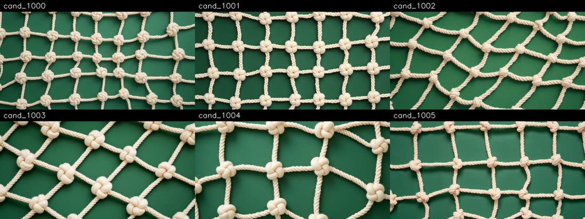
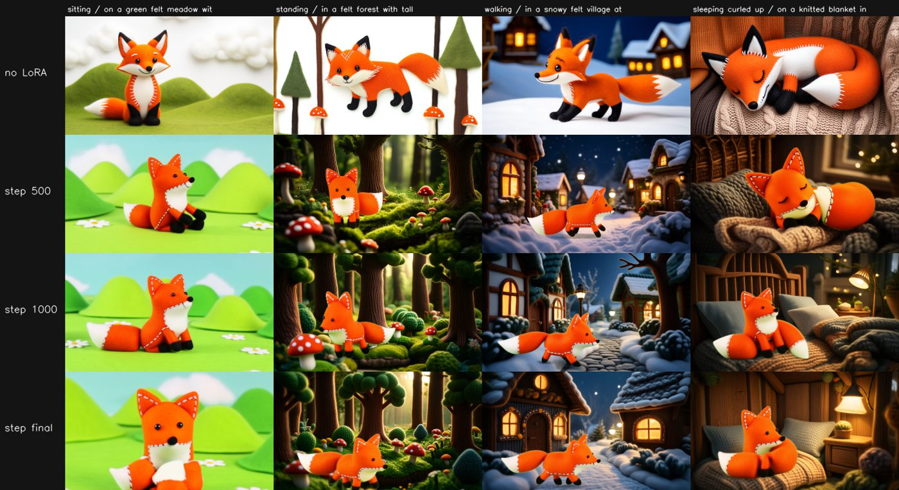
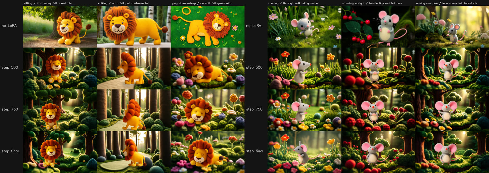
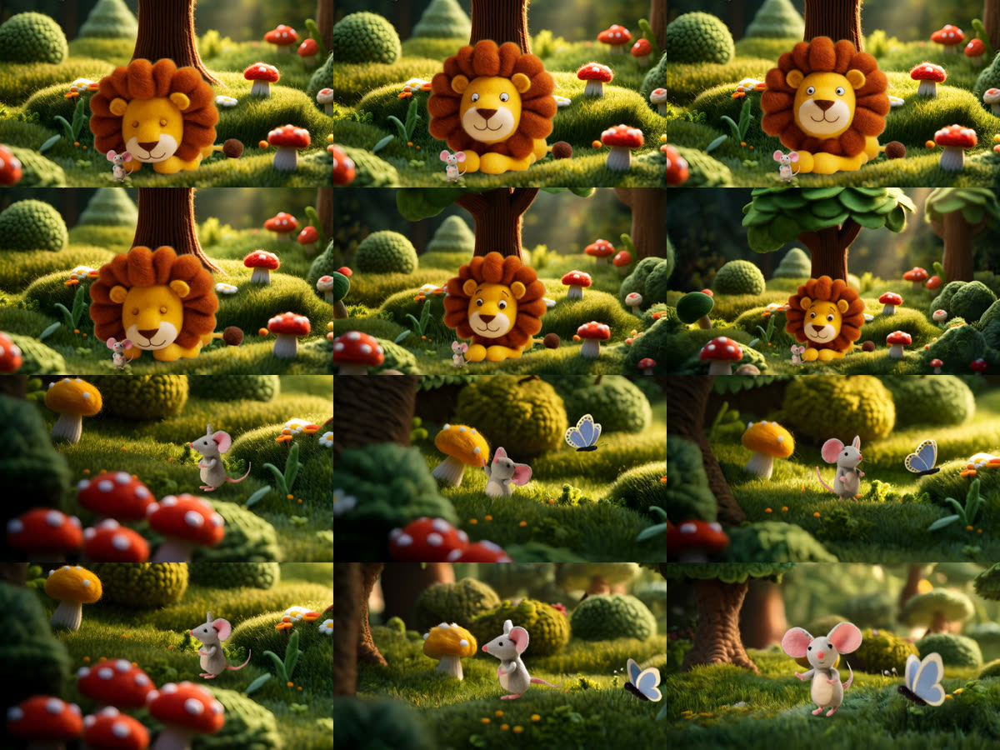

# Producing a felt-animal fable: the complete guide

> **2026-10-06:** the tools for the older method (`production/design.py`, `install_pack.py`,
> `compose_keyframes.py`, `character/character.py`, `lora/`, `edit_image.py`) and the Lion and Mouse
> v2-v4 folders were removed (they remain in git history). Sections that use them describe how
> earlier versions were made. Current flow: owner-made stills -> `production/export_runtime.py` ->
> `production/shot.py --fast` (see `CLAUDE.md`).

How to go from a story idea to a finished, consistent, monetisable children's
video with this repo. Worked example throughout: **The Lion and the Mouse**.
The measured examples below come from its first version (v1, whose files
were removed on 2026-09-27). V3 was reviewed by the owner; current work is
[v4](../stories/lion_and_mouse_v4/README.md): its stills were made from
2026-09-30 to 2026-10-02 and are under owner review; no v4 clip exists yet.
Narration and character voices: Gemini TTS (`voice/`); music and sound
effects: none used yet (ElevenLabs kept as a later option); final mix: DaVinci Resolve.

## Current production policy (2026-09-30; status updated 2026-10-02)

Read [creation rules](creation-rules.md), [prompt records](prompt-records.md)
and [v4 preflight](v4-preflight.md) before using a command below. Sections 2–7
preserve earlier technical experiments; their character descriptions, example
seeds and timings are historical. Current identity is approved-image-led: brown
eyes, full rust-orange Leo mane, smooth-crown slender Milo, standing scale 1:3.
Character LoRAs are not part of the default image-to-video workflow. This does
not exclude the separate Lightning acceleration adapters used by fast mode.

V4's bible and manifest hold the complete prompts and, since generation began,
each accepted image's result. They are not runtime YAML or automatic
validators. First approve story sequence and canonicals, then pairs, then a
small individual-clip pilot. Review/choose takes before a separately requested
animatic. Never append assembly to a render batch. The v4 stills were made
with commercial image models (see [gemini-images.md](gemini-images.md)), not
with `design.py` or `keyframe.py`; the owner now makes new images personally.

The platform/licensing discussion below is retained from earlier research;
this documentation pass did not re-check external policies.

## 0. What "professional" means here

A children's fable works when a child can follow it without effort: the same
characters, in recognisable places, doing one clear thing at a time, towards a
kind message. Every technical rule below serves that.

It is also what the platform pays for. YouTube's **quality principles for
kids and family content** reward videos that model *"Looking after yourself
and others"* (kindness, good friendship) and *"Creativity, play, and a sense of
imagination"* (storytelling), and demote content that is *"Hard to follow"*
(jumbled storylines) or *"Sensational or misleading"* ([YouTube Help][yt-kids]).
Channels with a strong focus on low-quality made-for-kids content can be
suspended from the Partner Program ([YouTube Blog][yt-kids-blog]).

Separately, YouTube's **inauthentic-content policy** (renamed from
"repetitious content" in July 2025, clarified in July 2026) removes
monetisation from *"generic, repetitive, or template-based"* videos made with
minimal variation using AI, from *"off-putting or distressing"* content, and
from AI personas on sensitive topics ([TechCrunch][tc-2026], [Tubefilter][tf-2026]).
YouTube's own example of distressing content is **animals in distress followed
by a rescue**, which is the shape of many fables. AI assistance itself is
fine when it *"enhances creativity"* and the result is high quality.

What this means in practice:

| Rule | Why |
|---|---|
| Every story is original in its telling: your script, your direction, your characters | template-made, look-alike videos are what the inauthentic-content policy targets |
| Characters never change appearance between shots | inconsistency makes a story "hard to follow" |
| Peril is brief, mild and resolved kindly; never the thumbnail | "animals in distress then rescue" is YouTube's own example of distressing content |
| No logos, brands, products, recognisable third-party characters | "heavily promotional", "strange use of children's characters" |
| Mark the videos *Made for kids* | required for child-directed content (it disables personalised ads and comments) |

**AI disclosure.** YouTube requires the *altered or synthetic content* label only
for *realistic* content that could be mistaken for a real person, place or
event; clearly unrealistic or animated content is exempt ([YouTube Blog][yt-ai]).
Felt stop-motion animals are clearly unrealistic, so the label is not required;
a line in the description ("Animated with the help of AI tools") is honest and
costs nothing.

## 1. Historical pipeline at a glance (current order in section 9)

```
story.yaml ──► design ──► characters ──► locations ──► shot plan ──► render ──► post ──► edit
 (bible)      (stills)   (canonical,    (plates)      (one action   (Wan I2V   (RIFE,    (ElevenLabs
                          turnarounds,                 per shot)     from key-  ESRGAN,   narration,
                          LoRA)                                      frames)    grade)    music, cut)
```

| Stage | Tool | Output |
|---|---|---|
| Story bible | `stories/<slug>/story.yaml` | style, characters, locations, scenes: the only place story facts live |
| Design | `production/design.py candidates / sheet / pick` | candidate stills; the chosen **canonical** still per character and location |
| Character pack | `character/character.py` (turns, angles, dataset) | a pose/angle library, and the LoRA dataset |
| LoRA | `lora/` (musubi-tuner) | a small model per main character |
| Shots | Wan 2.2 image-to-video from keyframes | 5 s clips, one action each |
| Post | `bllt/post.py` | 1080p30, learned interpolation and upscaling, grade |
| Edit | your editor + ElevenLabs | the finished episode |

## 2. The story bible (`story.yaml`)

Everything the story needs is written once, here, and pasted verbatim by the
tools into every prompt:

- **style** and **negative**: the look of the whole film. Never change them
  mid-story.
- **characters**: a frozen **sheet** each (the exact description), a trigger
  word for the LoRA, personality, and relative **scale** (historically Milo was 1/6 of Leo; v4 uses 1/3 of neutral standing height).
- **locations**: a sheet each; every shot set there starts from the same plate.
- **scenes**: the author's text, then the shot breakdown.

Writing a character sheet:
- Name the details that must never change: colours, materials, eye style, the
  one distinctive feature (Leo's burnt-orange mane, Milo's oversized pink ears).
- Materials, not photographic words: "needle-felted", "stitched", "wool".
- One sheet per character, frozen. Change the *action*, never the sheet.

## 3. Design: characters and places as stills

Before anything moves, every character and location gets **one canonical
still**. Everything later starts from it.

```bash
W=lumi/run_in_container.sh   # from the repo root
$W python production/design.py prompt                     # see the prompts
# GPU: design.py candidates -n 6                                    # ~2.5 min per still
$W python production/design.py pick --entities leo --seed 1003
$W python production/design.py reframe --entities milo    # small characters
```

**Same model for design and animation.** The candidates are drawn by Wan 2.2
itself (a one-frame video), so the character that gets animated is exactly
the one that was designed. A different image model would introduce a second
interpretation of the sheet.

**Characters are shot as model sheets**: whole body, three-quarter view,
neutral pose, alone on a plain felt backdrop. The plain backdrop is not an
aesthetic choice; it is what lets the character be cut out cleanly later.


**How to pick.** The chosen still must agree with its own text sheet, because
the sheet is pasted into every prompt forever after. For Leo, 1003 was picked
over the more striking 1005 (a mane of felt balls): the sheet says "large
fluffy mane", and a canonical that contradicts its sheet gets pulled back
towards the text in every shot. If you prefer a candidate that contradicts the
sheet, rewrite the sheet to match it; never keep both.

What the model does not follow: it drew Leo's eyes black in all six
candidates although the sheet said "warm brown stitched eyes", and it added a
cream muzzle nobody asked for. Decide once whether to accept such changes (and
edit the sheet) or to keep asking for them. For Leo the owner kept the black
eyes, and the sheet now says "small black stitched eyes": the sheet describes
what the images show.

**Small characters get reframed.** Milo is correctly tiny in his design shot,
but that leaves too few pixels to animate or to train on. `reframe` crops
around him (the box comes from the matting model), keeps 16:9, and upscales
with Real-ESRGAN back to 1280x720. It asserts that the character is inside the
crop and fills a sensible share of it; the first, unchecked version produced
an image of empty floor, and nothing downstream would have noticed.


**Locations are empty plates**: the set with no characters, the centre left
open as a stage. Pick for the story's needs, not for beauty alone: for Scene 1
the clearing needs morning light and open grass in front of the tree where Leo
can sleep.


**Say that the place fills the frame.** With "an empty miniature set", half of
the berry-patch candidates came out as isolated props on a studio table, not
as a place. The location prompt now says the scene fills the frame edge to
edge, with no backdrop and no table.

**Props** (objects the story needs, under `props:` in the bible) are designed
the same way: `design.py candidates --entities net`. They are laid out on a
plain floor in a colour that contrasts with them (a cream net on a cream floor
would not cut out). Write prop sheets in positive words only ("soft, floppy,
like a knitted toy", not "not dangerous"): the text encoder reads "not
frightening" as a mention of "frightening". All six net candidates came out as
nearly the same net, so a simple prop, like a simple secondary character
(the butterfly), stays consistent from its sheet alone.



Picks for The Lion and the Mouse: Leo 1003, Milo 1001 (reframed), butterfly
1004, clearing 1002, trap site 1004, berry patch 1003, net 1001.

## 4. Keyframes: the character, in the place, before anything moves

Image-to-video keeps what is in the first frame. So each shot's first frame is
composed: the character cut out of a pose still and placed into the location
plate (`production/keyframe.py`).

```bash
$W python production/keyframe.py --plate PLATE.png \
    --char STILL.png:x=0.5,y=0.80,h=0.42 --out KEY.png   # x,y = where the feet go
```

- **Matting**: BiRefNet (MIT licence, revision pinned because it runs remote
  code). A colour key was tried first; it cut a notch out of Milo's neck,
  because his grey felt is close to the grey-green backdrop.
- **Scale:** `h` controls the cropped pose box as a fraction of frame height.
  Equal `h` values do not preserve anatomy across poses. V4 calibrates skull and
  torso first, then derives pose-specific `h`; Milo is 1/3 of Leo's neutral
  standing height at equal depth (see creation rules CR-03).
- A soft **contact shadow** under the feet grounds the character. Only the
  **brightness** is matched to the plate, never the hue: colour matching once
  turned the fox's white chest green, and a character's colours are part of
  its identity.
- `flip` mirrors a pose still, so one side view serves both directions.


**Place the character on the in-focus plane.** The Scene 2 v2 keyframe put a
sharp Milo with his feet over the *blurred* foreground mushrooms, so he read as
floating in front of things that should be in front of him. Put the feet on
ground that is in focus in the plate, at the depth the character's scale
implies.

Known limit: the character keeps the flat studio light of the design shot,
while the plate is backlit. That is acceptable in a *first frame*, because the
video model relights the character as it animates (confirmed in Scene 3: after
a second nothing looks pasted); it would not be acceptable in a still.

**Leave room to move into.** A character who will walk or run faces the open
side of the frame, with space ahead of them. The first Scene 6 keyframe put
Leo at the left edge facing left, so he would have left the frame at once; he
was flipped to face right, on the path, with the path opening ahead.

**Keyframes are recipes in the bible, not loose files.** Write the composition
into the shot, and `shot.py` builds the keyframe on the GPU node when it is
missing (seconds there, 15-25 min on the login node):

```yaml
- name: s06_leo_walks
  keyframe: keyframes/scene06_walk_v2.png
  compose:
    plate: design/trap_site/canonical.png
    crop: [0.25, 0.35, 0.5]          # optional virtual close-up (x, y, width), upscaled
    characters:
      - {still: characters/leo/poses/leo_turns_side_last.png, x: 0.22, y: 0.88, h: 0.40, flip: true}
```

Compose on the login node first when you want to look at it before spending
GPU time (`keyframe.py` as above), which is what you should do for any new
framing.

**Continuity between shots**: a shot can start from a frame of another shot's
chosen take instead of a composition, so the cut is seamless (Scene 4 starts
on the last frame of Scene 3):

```yaml
continue_from: {shot: s03_leo_wakes, take: 5302}   # frame: -1 (last) by default
```

## 5. The character pack: poses and views

A character needs more than one picture: other views for other camera angles,
the key poses the story calls for, and material for the LoRA (section 6).
Each pose is a short image-to-video shot that starts from the canonical still,
on the plain design backdrop, so every pose can later be cut out and placed.

Poses live in `stories/<slug>/packs/<character>.yaml`; the character's
description, the style and the negative prompt come from the story bible, so
a pose file is just a list of actions:

```yaml
- name: leo_sleeps
  from: canonical
  action: Leo slowly lies down on his belly, rests his round head on his big
          front paws and gently closes his eyes.
```

The complete, measured prompt rules are in **[prompting.md](prompting.md)**;
read it before writing any action. The short version, measured on the fox,
Leo and Milo:

| Action | Result |
|---|---|
| sit down, lie down (one slow whole-body movement) | reliable |
| turn to face the camera, turn around | reliable: the way to get front and back views |
| camera orbits around a still character | identity perfect, but only ~30 degrees of rotation |
| look up / raise the head | too subtle: the pose barely changes |
| "looks up at the clouds drifting overhead" | the model animated the clouds instead |
| sit down (Leo), wave a paw "high, side to side" (Milo) | reliable |
| "walks slowly and calmly forward" (Leo) | did not travel: a pose shuffle |
| "runs quickly forward in a happy scamper" (Milo) | ran out of frame |


Rules that follow:
- **One whole-body action per shot.** Small gestures from a still start do not
  register; if a head movement matters, make it the whole shot's point and
  exaggerate it.
- **The action names only the character's body.** Anything else it names (the
  clouds, a butterfly) is something the model may animate instead.
- **Turn the character, do not orbit the camera**, to get new views.
- **Locomotion needs an energetic verb, a direction and a fixed camera.** A
  tracking camera ("glides alongside him, keeping him centred") made the camera
  move instead of the character (Scene 2 v2); see prompting Rule 2.10.
- 3 s (49 frames) is enough for one pose change and takes about an hour.

## 6. Character LoRA: teaching the model *your* character

A keyframe fixes the character at the first frame of a shot. A LoRA (a small
add-on to the video model, a few hundred MB) goes further: the model learns the
character, so a prompt containing its trigger word (`twcfox`) draws it in any
place and pose, with no anchor image.

```bash
$W python lora/build_dataset.py fox          # captioned stills
# GPU, two tasks in parallel (one per Wan expert, ~1 h 10 min for 1500 steps):
#   bash lora/train_character.sh fox low 1500
#   bash lora/train_character.sh fox high 1500
# GPU: bash lora/eval_character.sh fox base 500 1000 final
$W python lora/eval_grid.py fox base 500 1000 final
```

**Dataset.** 20-40 stills from the character pack (section 5): canonical,
turns, story poses, full body plus medium crops. Every caption follows one
recipe, so what should stay controllable is spelled out and not absorbed into
the character:

> `twcfox, a small orange felt fox, sitting, three-quarter view, full body, on a green felt meadow ..., handmade felt stop-motion animation`

**Training.** Trainer: [musubi-tuner](https://github.com/kohya-ss/musubi-tuner)
(Apache-2.0). Wan 2.2 has two experts; each gets its own LoRA, trained in
parallel on its own GPU. Measured: training both experts in one run costs
11-13 s per step (28 GB of weights swap between CPU and GPU whenever a step
changes expert); one expert per run costs 2.6-3.5 s per step. Settings: rank 32,
alpha 16, learning rate 2e-4, AdamW, flow shift 3, 1500 steps, a checkpoint
every 250.

**Evaluation.** The same seeds and prompts for every checkpoint, plus a row with
no LoRA that uses the full text description instead. Three of the four prompts
put the character somewhere the training data never showed.


What the grid shows, in order:

1. **Without a LoRA, the full text description gives four different foxes**
   (black-tipped ears, eyebrows, other faces). Text cannot pin a character.
2. **By step 500 it is our fox, everywhere**: stitched ears, bead eyes, the
   stitched chest, black paws, white tail tip, in a forest, a snowy village
   and on a blanket.
3. **After that, the LoRA mostly memorises the background.** From step 1000 the
   forest prompt returns the training meadow. Every training image had that
   meadow behind the fox.
4. Pose follows the data: "sleeping curled up" came out lying stretched at
   step 500, because no training image showed a sleeping fox.

**The fix, measured (`fox_v2`).** The same stills, plus each full-body still
cut out (BiRefNet) and composited into two random location plates (67 images
instead of 31); everything else identical, same evaluation prompts and seeds:



- **The background leak is gone at every checkpoint.** The forest prompt gives a
  forest, the village a full village, the bedroom a bedroom, with the fox
  on-model in all of them.
- **Even the untrained pose improved at step 500**: the fox is really curled up
  asleep, eyes closed, on the blanket.
- **Pose freedom shrinks with training.** By step 1000 and at the end the
  "sleeping" fox sits awake in the bedroom: the LoRA pulls towards the poses it
  was trained on.

Recipe that follows: composite every full-body still into varied plates
(`composite:` in the dataset file), include every pose the story needs, train
about 1000 steps with a checkpoint every 250, and choose the earliest checkpoint
whose identity holds. Compositing never changes the character's colours: a
character's colours are part of its identity.

**Leo and Milo (the story's LoRAs).** Same recipe: composited plates (22 of
~34 images each), every story pose, 1000 steps, rank 32. Evaluated with the
same method, on prompts outside the data:



- Without a LoRA, the full text sheet gives a different lion (thin fur mane,
  whiskers, flat storybook look) and a different mouse (whiskers, small ears)
  in every image.
- With a LoRA, every checkpoint gives *our* Leo (felt-ball mane, cream muzzle)
  and *our* Milo (huge pink ears, red-pink nose, cream belly), in places the
  training never showed. No background leak.
- **Step 500 follows the prompt's pose best**: Leo walks side-on and sleeps
  lying down; at step 750 "walking, side view" became a back view. Chosen: 500
  for both (the same as fox_v2).
- Milo's "running" and "waving" are weak at every checkpoint (upright, paws at
  the chest). Not a problem for shots, where the keyframe and the action carry
  the motion, but a LoRA alone will not produce a pose like that.

**Historical optional LoRA mechanism (not the v4 default).** The LoRAs are trained on the text-to-video model,
but shots are image-to-video from a keyframe. The two share the layers a LoRA
changes (attention and feed-forward; all 400 targets exist in both experts of
the I2V model), so the same files load into it. A shot opts in with
`lora: true`; each character in it with a chosen checkpoint (`lora: {name,
step}` under the character) gets its adapter, and its trigger word enters the
prompt the way the captions had it ("Leo the lion is twcleo, a large ...").
`bllt/wan.py` asserts the adapters are active on both experts.

**Measured: in keyframe shots the LoRA does more harm than good.** Same shots,
same seeds, with and without (rows: Scene 3 plain, Scene 3 + LoRAs, Scene 2
plain, Scene 2 + LoRA; frames 0, 40, 80):



- Identity was already held by the keyframe over 5 seconds; the LoRA added
  little (Milo slightly more on-model when he turns to the camera).
- The **location drifted**: with the LoRA the camera pulled back and the model
  drew a different tree canopy (Scene 3), or a different forest altogether
  (Scene 2). The LoRA weakens the keyframe's hold on everything, not only on
  the character.

So shots are rendered **without** LoRAs by default. The LoRAs remain the tool
for text-to-video (no keyframe), for designing new poses and keyframe stills
of the characters, and possibly at a lower weight for long shots where a
character turns far from its keyframe pose (untested).

## 7. Shots: write, check, render, choose

A shot is one entry under its scene in `story.yaml`: a keyframe (or a
`compose:` recipe, or `continue_from:`), the characters in it, seeds, and an
**action**. The tool assembles the prompt as action + each character's sheet
+ the location's sheet + the style, so you write only the action (and a
`negative_extra` with this shot's likely failures). Rules and checklist:
**[prompting.md](prompting.md)**.

```yaml
- name: s03_leo_wakes
  keyframe: keyframes/scene03_wake.png
  characters: [leo, milo]
  frames: 81                 # 5 s at 16 fps, Wan's native length
  seeds: [5301, 5302]        # two seeds for anything that matters
  action: >-
    Close-up at ground level. Leo the lion lies with his big front paws in front
    of him, and tiny Milo the mouse stands frozen on the grass right in front of
    Leo's paws. Leo slowly lifts his round head and opens his eyes wide in
    surprise ...
  negative_extra: angry face, teeth, roaring, scary, second lion, second mouse, ...
```

```bash
$W python production/shot.py --scene 3 --shot s03_leo_wakes --dry-run   # read the prompt
# GPU (one line per seed in a task file, submitted with lumi/run_tasks.sbatch):
#   python production/shot.py --scene 3 --shot s03_leo_wakes --seed 5301
```

Output: `work/stories/<slug>/shots/<shot>_s<seed>.mp4` plus a `.json` with the
exact prompt, negative, seed, model revision and LoRAs. About 2.5 h per clip
(25 min model load + 40 steps x ~190 s); the four GCDs of a job render four
clips in parallel.

**Review every clip as a contact sheet** (a frame every 10) and at full size for
the key moments; record what worked and what failed in prompting.md's results
log, and turn every failure into a rule or a negative.

**Choose a take** by writing `take: <seed>` on the shot: the animatic and the
next shot's `continue_from` use it. Other bookkeeping fields:

| Field | Meaning |
|---|---|
| `take: 5302` | the chosen render |
| `superseded_by: <shot>` | a failed version kept for the record (skipped by the animatic) |
| `variant_of: <shot>` | an experiment on the same shot, e.g. with LoRAs (skipped by the animatic) |
| `lora: true` | use the characters' chosen LoRAs in this shot (section 6) |

Measured so far: sleeping and waking (Scenes 1, 3), two characters in one shot
without blending (Scene 3), a secondary character from its sheet alone (the
butterfly), walking across the frame with a fixed camera (Scene 6), a startled
turn (Scene 7). Partly solved: a run (it leaves the frame, but not cleanly
side-on). Not yet tested: contact between characters (Scenes 4, 8), a prop
event (the net, Scene 6). Current results: CLAUDE.md "Current state".

## 8. Animatic and hand-off: a separate reviewed stage

Deliver individual clip candidates first. The owner chooses exact filenames,
revisions, modes, seeds, trims and order. Record those choices, then assemble only
on the owner's separate instruction. Do not launch an animatic after each batch.
The present `animatic.py` can choose standard files before fast ones and silently
fall back to stills/cards. Audit its actual input mapping; it is not an approval
gate. Its equal scene-audio splitting does not align individual dialogue lines.

Narration and character voices use Gemini TTS (`voice/`), generated only when
requested. Approved per-line audio durations inform coverage before expensive
renders; this can be a timing table without an automatically built animatic.
Scene audio lives under `work/stories/<slug>/audio/<lang>/sceneNN.wav`.
Plan more coverage when a line exceeds a usable clip; do not loop a five-second
shot or play mouth alternatives consecutively just to fill narration.

The selected edit goes to DaVinci Resolve. Post-processing (`bllt/post.py`) uses
interpolation/upscaling; inspect the result for newly warped paws, faces and rope.
Back up chosen media, exact prompt logs and source references together.

## 9. Current workflow, step by step

1. **Review story order:** map every owner observation to a rule and image/shot
   record. Review contact, trigger and rescue causality before making images.
2. **Freeze identity:** revised v4 smooth-crown Milo, full canonical Leo mane,
   brown eyes, calibrated anatomy and equal-depth standing ratio 1:3. Approve
   canonical mouth designs before any speaking or gnawing variant.
3. **Record every image:** fully expanded prompt, exclusions, ordered reference
   roles/paths, counts, camera, light, pose, contacts, prop/occlusion state,
   allowed delta and observable acceptance checks. Log actual attempts later.
4. **Build references:** canonicals, views, pose calibration, mouths, empty
   location plates and prop materials. Extract a clean trap-path plate; do not
   use a background with a pre-fall net for a post-fall close-up.
5. **Create registered endpoint pairs:** each character shot needs start/end.
   Preserve skull/torso scale when a pose changes; equal bounding-box `h` is not
   anatomical calibration. Preserve static scene landmarks and cumulative rope
   damage. Inspect the saved files and their cut handoffs.
6. **Prepare runtime recipes later:** derive supported story fields from approved
   manifest records. Pass `--story` explicitly. Rebuild stale matte/crop/keyframe
   caches after source changes. Review the full specification and the complete
   runtime positive/negative. Measure actual tokenizer limits; fast CFG 1 has no
   negative pass, so put critical desired states positively and in the anchors.
7. **Pilot individual clips:** scale transition, sleep/contact/wake, readable run,
   fray/cut and closed/mouth alternatives. Fixed backgrounds with gentle local
   leaf/water/cloud motion. Keep character LoRAs off. Review full playback and
   sampled frames; repair causes before expanding the render batch.
8. **Owner selection then separate assembly:** preserve candidates and record
   exact owner choices. Assemble only when requested, then inspect post/edit.
9. **Back up** assets and provenance. The owner handles all git commands
   (agents only on the owner's explicit request).

See [v4 preflight](v4-preflight.md) for the complete checklist and known tool
limitations. These are manual production gates, not newly implemented code.

## What is next, and what may be missing

See **[findings-and-risks.md](findings-and-risks.md)**: every problem found and
its fix, and the gaps not yet covered (backups before the project's data is
deleted, narration-first timing and animatics, dialogue without lip-sync,
two-character contact shots, props, the trap scene and YouTube's policy,
Made-for-kids settings, pinning model versions, render throughput, a shared
style for the series).

## Sources

- [yt-kids]: YouTube Help, *Best practices for kids & family content*, https://support.google.com/youtube/answer/10774223
- [yt-kids-blog]: YouTube Blog, *Our responsibility approach to protecting kids and families on YouTube*, https://blog.youtube/news-and-events/our-responsibility-approach-protecting-kids-and-families-youtube/
- [tc-2026]: TechCrunch, *YouTube clarifies policies around AI slop and upsetting videos* (20 Jul 2026), https://techcrunch.com/2026/07/20/youtube-clarifies-policies-around-ai-slop-and-upsetting-videos/
- [tf-2026]: Tubefilter, *YouTube inauthentic content monetization policy update* (13 Jul 2026), https://www.tubefilter.com/2026/07/13/youtube-inauthentic-content-monetization-policy-update/
- [yt-ai]: YouTube Blog, *How we're helping creators disclose altered or synthetic content*, https://blog.youtube/news-and-events/disclosing-ai-generated-content/

[yt-kids]: https://support.google.com/youtube/answer/10774223
[yt-kids-blog]: https://blog.youtube/news-and-events/our-responsibility-approach-protecting-kids-and-families-youtube/
[tc-2026]: https://techcrunch.com/2026/07/20/youtube-clarifies-policies-around-ai-slop-and-upsetting-videos/
[tf-2026]: https://www.tubefilter.com/2026/07/13/youtube-inauthentic-content-monetization-policy-update/
[yt-ai]: https://blog.youtube/news-and-events/disclosing-ai-generated-content/
