# Writing prompts that work

This is the historical experiment log for Wan 2.2 and the felt-animal style.
Rules label observations and precautions; they are not universal model guarantees.
For current production, [creation-rules.md](creation-rules.md) takes precedence.
The [v4 packet](../stories/lion_and_mouse_v4/README.md) records the owner's v3
failures and their draft remedies. Follow [v4-preflight.md](v4-preflight.md) in
addition to the historical checklist below. No v4 remedy is yet render-validated.

Where the tools put your text: every prompt is assembled as

```
<ACTION>  <Character> is <frozen character sheet>.  The scene is <location sheet>.  <style bible>.
```

`production/shot.py` and `character/character.py`
both build it this way from `stories/<slug>/story.yaml`. Runtime recipes supply the ACTION and optional per-shot negative; sheets and
style are appended. For v4, save the **entire expanded positive and combined
negative** in the prompt record, including references and endpoint state, before
exporting a runtime recipe. Check the actual assembly for duplicated/conflicting
text, positive and combined negative together (the 2026-09-30 dry-run printed
only the positive).

---

## 1. Consistency: what text can and cannot do

**Rule 1.1: text alone cannot keep a character the same between shots.**
The full description of the fox, word for word, produced four different foxes
in four prompts (black-tipped ears, eyebrows, different faces). The felt bunny
was a different animal from shot to shot.
*Evidence:* `docs/img/fox_lora_grid.jpg`, row "no LoRA".
*Therefore:* every shot starts from an image of the character (a keyframe,
section 4 of the production guide). Character LoRAs were useful in early
text-to-video experiments; later I2V A/Bs worsened the location, so keep them off
for v4 keyframe shots. Fast-mode Lightning adapters are a different purpose.

**Rule 1.2: never reword a character or location sheet.** The sheet is frozen
text. Change the action, never the description. Rewording is how a second,
slightly different character gets in.

**Rule 1.3: name the details that must never change.** Colours, materials, and
the one distinctive feature: Leo's burnt-orange mane, Milo's oversized pink
ears, the fox's white-stitched inner ears. Vague sheets drift more.

**Rule 1.4: the canonical image must agree with its sheet.** The sheet is pasted
into every prompt forever. If the chosen design image contradicts it (a
felt-ball mane when the sheet says "fluffy mane"), every shot pulls back
towards the text. Rewrite the sheet to match the image you chose, or choose
another image; never keep both.

**Rule 1.5: some details the model will not follow.** It drew Leo's eyes black
in all six design candidates although the sheet says "warm brown stitched
eyes", and it added a cream muzzle nobody asked for. Decide once: accept it and
edit the sheet, or keep asking. Do not leave the sheet saying something the
images never show.
*Historical v1 decision (2026-09-26): black stitched eyes. Superseded by the
owner-made current cast: Leo and Milo have brown irises and cream sclera. Never
copy the v1 eye description into v4.*

## 2. The action line

**Rule 2.1: one whole-body action per shot.**

| Action (starting from a still) | Result | Evidence |
|---|---|---|
| sit down | reliable | `p_sit.jpg`, fox_sits |
| lie down and go to sleep | reliable | leo_sleeps |
| turn to face the camera / turn around | reliable | `p_turn_camera.jpg` |
| raise a paw and wave "high, side to side" | reliable | `p_wave.jpg` |
| press paws together (the gesture *is* the shot) | works, gentle | milo_paws_together |
| raise the head / look up | **does not register** | `p_head_raise.jpg` |
| hop three times | **character teleports** | felt bunny |
| lie down *and* close the eyes (v2 Leo) | lies down, eyes stay open | leo_sleeps |
| close the eyes, as the whole shot, from a lying frame | reliable (1 of 2 seeds) | leo_closes_eyes_a |

A small movement of one body part, starting from a still, is usually lost.
If a gesture matters, make it the whole shot and describe it big ("raises one
tiny paw **high** and waves it **from side to side**").

**Rule 2.2: give the main character action priority.**
*Bad:* "The fox looks up at the cotton clouds drifting overhead." The model
animated a cloud sliding across the sky; the fox did not move.
*Good:* "The fox slowly raises his head and tilts his nose upward, ears pricked."
Anything else the action names (clouds, a butterfly, a leaf) is something the
model may animate *instead* of the character. The location sheet already puts
those things in the scene.
V4 still requires a separate bounded ambient clause: subtle water ripples and
leaf/cloud motion must persist across clips while trunks, roots and rocks stay
fixed. Ambient motion must not replace the main action or imply camera movement.

**Rule 2.3: locomotion needs an energetic verb.**
*Bad:* "Leo walks slowly and calmly forward on his short rounded legs." Leo
turned towards the camera and back, shuffling, and never moved forward
(`p_walk_slow.jpg`).
*Good:* "Milo runs quickly forward on his tiny feet in a happy scamper." Milo
leaned in and ran out of frame (`p_run.jpg`).
"Slowly", "calmly" and "gently" on a movement verb read as a pose change. For
a walk that must travel, say where to: "walks steadily across the clearing
from the left edge to the right edge", and check the result.

**Rule 2.4 (superseded tracking advice): plan the runner's travel lane.**
Early tests suggested following the runner; later Rule 2.10 showed a tracking
camera could move while Milo stayed still. V4 uses a fixed normal-height side
view, matching endpoint scale/depth and a bounded path. Cut before an unsafe
exit or split the travel; do not restore the old low-angle tracking prompt.

**Rule 2.5: the direction in the text must match the keyframe.** Milo's
keyframe had him facing left; the first Scene 2 prompt said "runs to the
right". Read the keyframe before writing the action: a character runs the way
it faces.

**Rule 2.6: turn the character, not the camera, to get new views.** "The camera
orbits around the fox" held identity perfectly but turned only about 30
degrees. "The fox slowly turns around until his back faces the camera" gave a
true back view.

**Rule 2.7: say what must NOT change, and put the opposite in the negative.**
Scene 1, seed 5101: the prompt said Leo sleeps; he opened his eyes and smiled
at the camera. The fix is two-sided:
- action: "stays fast asleep beneath the tree **the whole time**, his eyes
  **closed**"
- `negative_extra`: "open eyes, awake, looking at the camera, standing up"
**Confirmed:** with both halves, seed 5103 kept Leo asleep for all five
seconds while the camera moved in.

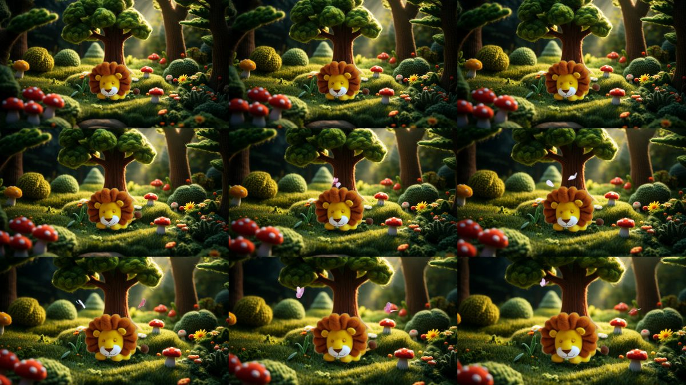

**Rule 2.8: one clear camera move, stated once.** "The camera slowly moves
closer to Leo" works. Two moves in one shot ("pulls back, then orbits, then
dives") get merged or ignored.

**Rule 2.8b: a camera move that reveals what the keyframe does not show
makes the model invent it, and the invention will not match the location.**
Scene 2 v1: the keyframe was a close-up of the clearing that cut off the tree's
canopy; the camera tilted up and the model drew a canopy of flat felt leaves
instead of the clearing's woolly-ball canopy. Prefer push-ins (they reveal
nothing new), or compose the keyframe from the part of the plate that already
contains everything the move will show.

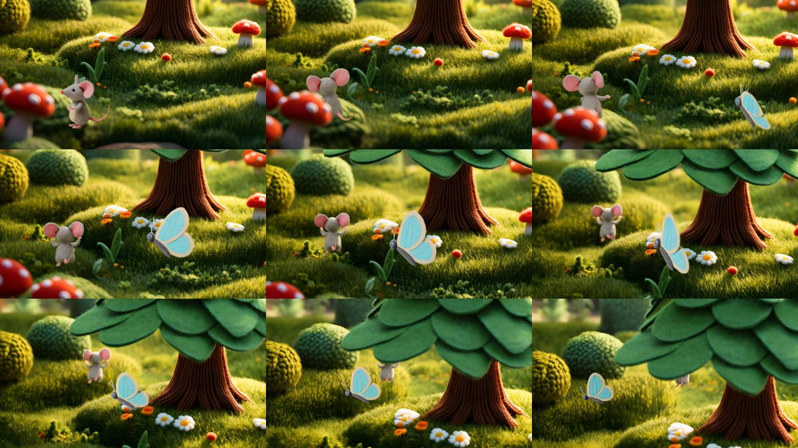

**Rule 2.9: keep secondary characters in the action, and keep main characters
out of shots they are not in.** The butterflies appeared because the action
names them. For a Milo-only shot, the negative carries "lion, big animal,
second mouse", so Leo does not wander in from the story's context.
A secondary character with only a text sheet and no keyframe can still come out
on-model when its sheet is specific: the pastel-blue felt butterfly with cream
edging matched its design exactly in Scene 2.

**Rule 2.10: "runs to the left" plus "the camera follows" is not enough to get
a run across the frame.** In Scene 2 v1 Milo turned his back and ran away into
the depth of the scene, shrinking until he vanished. Say the geometry
explicitly: "seen from the side, Milo runs across the frame from right to left;
the camera glides sideways at ground level alongside him, keeping him in the
centre", and negate the failure ("running away from the camera, back view").
**Refuted as written (Scene 2 v2, seed 5202):** Milo no longer ran into
depth, but he did not run at all: the camera glided sideways and Milo turned
and bobbed on the spot. "Keep him in the centre of the frame" can be met by
moving the camera alone. The Milo run that worked (pose clip `milo_runs`) had a
fixed camera. Current version: side-on geometry, **a fixed camera**, and the
run crosses and leaves the frame ("runs across the frame from right to left
and out of the left edge; the camera stays still"); "standing still, on the
spot, camera tracking" in the negative.
**Confirmed for walking (Scene 6, both seeds):** with a fixed camera and room
ahead in the keyframe, Leo walked along the path across most of the frame
(the earlier "walks slowly" shuffled on the spot). **Partly for running (Scene
7):** Milo ran and left the frame, but diagonally into the plants rather than
side-on. Rows: Leo 6101, Leo 6102, Milo hears 7101, Milo runs 7201:

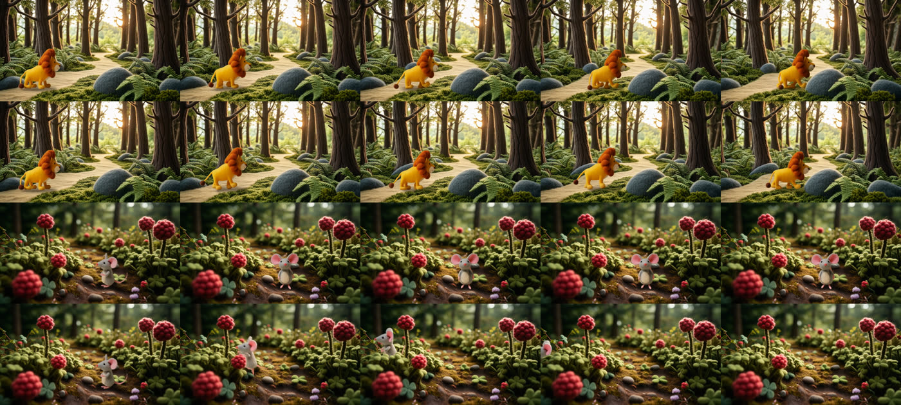

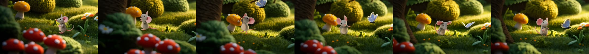

**Rule 2.11: story continuity beats a nice plate.** Scene 2 v1 showed Leo's tree
without Leo asleep under it, one scene after we saw him there. When a location
has a landmark tied to a character, either keep the landmark out of frame or
show the character in it.

**Rule 2.12: a camera move goes to the dominant subject, not to the one you
name.** Scene 4: "the camera slowly moves closer to tiny Milo" pushed in on
Leo both times; Milo, 1/7 of the frame high, stayed tiny and his paw gesture
was invisible. A small character's gesture needs its **own close-up keyframe**:
crop the continuity frame around them and upscale it (`compose` with only a
`crop:`), so the shot is still continuous with the one before.
**Confirmed:** from the close-up crop, Milo lifted his paws to his chin and
pleaded, clearly, in both seeds (s04_milo_pleads_v2).

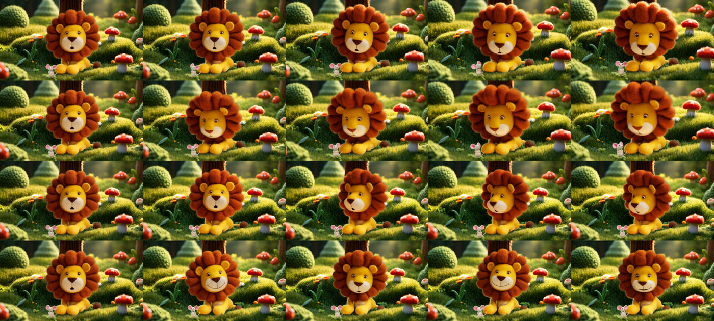

*(rows: pleads 4101, pleads 4102, smiles 4201, smiles 4202)*

**Rule 2.13: start and end keyframes from the same expression set make the
best close-ups; describe only a soft background.** The owner's expression
images (identical head-and-shoulders framing) composed on a blurred crop of
the plate, as first and last frame: Milo worried -> worried (a tremble) and
Milo surprised -> smile came out on-model for all 81 frames. Leo curious ->
smile *wandered* mid-shot: the background sharpened and a tree trunk appeared,
then the shot returned to the end frame. The prompt carried the full location
sheet ("a broad stitched tree trunk on the right..."), which asks the model to
show the trunk. In a close-up, replace the location sheet with the
background you want to see (`background:` on the shot: "a soft, completely
out-of-focus sunny felt meadow").

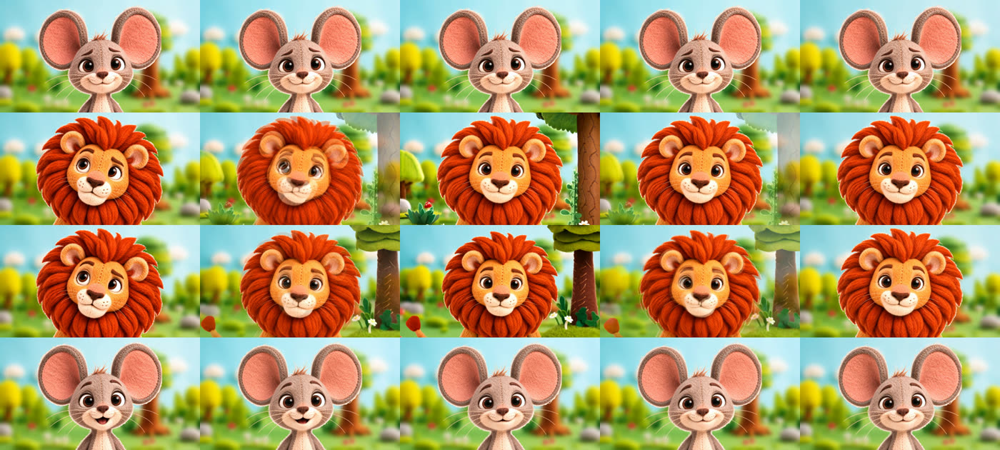

*(rows: Milo trembles, Leo softens 4201, Leo softens 4202, Milo smiles)*

**Rule 2.14: a continuation shot from a cropped close-up needs an end
keyframe too.** Scenes 5 and 6 started from the last frame of a two-shot that
was itself a crop of the clearing. With only a start frame, all six seeds
pulled the camera back and drew a different tree and sky (the model filled in
what the crop hides). "The camera stays still" did not stop it. Pin the end:
the same frame again for an in-place action (a nod), or the same crop
recomposed with the end state (Milo gone) for an exit.

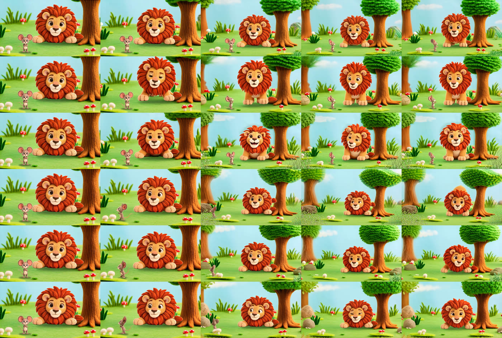

## 3. Words and framing

**Rule 3.1: materials, not photography.** "needle-felted", "stitched", "wool",
"felt". The style bible already carries "handmade felt stop-motion animation";
do not add "photorealistic", "realistic fur", "cinematic 8k" (they fight the
felt look; "photorealistic" and "realistic animal fur" are in the negative).

**Rule 3.2: locations must be told to fill the frame.** "An empty miniature
set" produced props on a studio table in half the berry-patch candidates. The
location design prompt says: the scene fills the frame edge to edge, no studio
backdrop, no table.

**Rule 3.3: design characters as model sheets.** Whole body, three-quarter view,
neutral pose, alone, on a plain felt backdrop. The plain backdrop is what makes
the later cut-out clean.

**Rule 3.4: give the model a destination when you need one.** The channel intro
came out best when the clip was given a white end frame to arrive at, rather
than asked in words to "end in a white flash".

**Rule 3.5: say what you want, not what you don't want, in the positive
prompt.** The text encoder reads "not frightening" as a mention of
"frightening". Carry the quality with positive words (soft, floppy, knitted)
and put the unwanted thing in the negative. *Status: precaution from how the T5
encoder works, not yet measured here.* The net's sheet was rewritten this way
before its first render.

## 4. Settings that are part of the prompt

| Setting | Use | Why |
|---|---|---|
| frames | 81 for scenes (5 s), 49 for pose clips (3 s) | 81 is Wan's native length; 97 frames ran at 250 s per step and could not finish in a 3 h job |
| seeds | 2 per important shot | seeds differ a lot (the same prompt gave one eyes-open and one eyes-closed Leo) |
| guidance | 3.5 / 3.5 image-to-video; 4.0 / 3.0 text-to-video | the two numbers are the high- and low-noise experts |
| negative | story negative + per-shot `negative_extra` | the per-shot part names this shot's specific failure |

### Fast mode (Wan2.2-Lightning), measured 2026-09-27

`shot.py --fast` / `character.py shots --fast`: the lightx2v 4-step
distillation LoRAs (Apache-2.0, revision pinned in `feltwillow/wan.py LIGHTNING`),
4 Euler steps, shift 5, CFG 1. At CFG 1 the code documents **no negative pass**:
a saved negative prompt does not establish that those terms constrained fast
inference. Put required states positively and in the endpoints; review output.
Check actual deployed tokenizer limits before using long prompts. V4 records a
compact runtime candidate separately from the full planning specification.

Same keyframes and seeds as two approved takes:

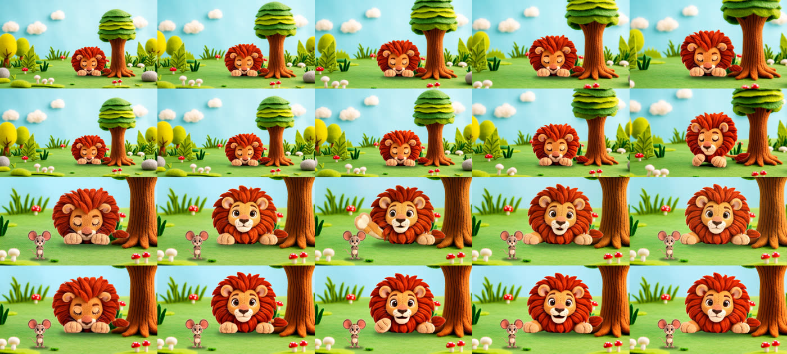

*(rows: Scene 1 40 steps, Scene 1 fast, Scene 3 40 steps, Scene 3 fast)*

- Render time **16 min instead of ~2 h 10** per clip (4 x 97 s + decode;
  the ~25 min model load is unchanged).
- Identity, colours, sharpness and the start/end keyframe behaviour are the
  same. Slightly more unrequested motion (sleeping Leo stirs at the end).
- Use: render 3-4 seeds fast and pick; one task renders all seeds of a shot
  with one model load. Keep 40 steps for shots where fast mode fails.

## 5. LoRA captions

Every caption: `<trigger>, <identity>, <pose and view>, <framing>, <setting>, <style>`

```
twcfox, a small orange felt fox, sitting, three-quarter view, full body, on a green felt meadow with felt hills, handmade felt stop-motion animation
```

- The trigger word (`twcfox`) carries the identity. Everything that should
  stay controllable is spelled out so it is *not* absorbed into the character.
- Caption what the frame shows, not what was asked for: the "looks up" frames
  where the head barely rose are captioned "standing, side view".
- Vary the background in the data, or the LoRA learns it: the fox LoRA drew the
  training meadow for a forest prompt from step 1000 on. `composite:` in a
  dataset file places cut-out characters into different location plates.

## 6. Checklist before a prompt goes to a GPU

1. The action has **one** whole-body movement, described big.
2. The main action names the character movement; a separate low-amplitude
   ambient clause preserves water/leaf continuity without moving static scenery.
3. A movement that must travel uses an energetic verb, explicit geometry
   ("seen from the side, across the frame from right to left"), a **fixed**
   camera, and room in the keyframe to travel into (the character faces the
   open side); the failures are in the negative ("running away from the
   camera, standing still, on the spot, camera tracking").
3b. The camera move only shows what the keyframe already contains (push-in),
   or the keyframe was cut to include what the move will reveal.
3c. No landmark tied to a character (Leo's tree) appears without that character.
4. The direction matches how the character faces in the keyframe.
5. What must stay still is stated ("the whole time, eyes closed"), and its
   opposite is in `negative_extra`.
6. Characters not in the shot are in `negative_extra`.
7. V4 baseline camera is fixed. A deliberate reframe needs its own reviewed
   plan and must preserve anatomy; wider-to-closer endpoints do not count as a hold.
8. No photographic or realism words.
9. The sheets were not edited for this shot.
9b. No "not ..." / "no ..." phrases in the action or sheets: they go in the negative.
10. `--dry-run` printed the assembled prompt and it reads as one clear picture.
11. V4 plans three candidate seeds per mode after the small pilot; a seed
    variation is not a separate closed/mouth prompt mode. Owner selects takes.

## Results log

Update this when a rule is confirmed, refuted or refined.

- 2026-09-30: owner v3 render review archived verbatim in
  [the review notes](reviews/lion_and_mouse_v3_owner_notes_2026-09-30.txt).
  New draft controls cover tuft removal, anatomical registration, persistent
  acorn/net damage, fixed trunks with moving foliage, matching endpoints,
  mouth alternatives and selection before assembly. See the
  [repair map](../stories/lion_and_mouse_v4/REPAIR_PLAN.md). Videos were not locally
  available in this pass; proposed causes and fixes are not confirmed v4 results.

- 2026-09-26: Rule 2.3 from leo_walks (slow, did not travel) and milo_runs
  (energetic, ran out of frame). Rule 2.5 from the Scene 2 keyframe.
- 2026-09-26: Scene 1 seed 5101, Leo woke up; seed 5102 stayed asleep. Rule 2.7
  fix (s01_establish_v2, seed 5103): Leo stayed asleep. **Rule 2.7 confirmed.**
- 2026-09-26: Scene 2 v1 (seed 5201): the butterfly came out on-model from its
  sheet; Milo ran away into depth instead of across (Rule 2.10); the tilt-up
  invented a different tree canopy (Rule 2.8b); Leo's tree without Leo
  (Rule 2.11). v2: a region of the clearing without the tree, Milo larger, explicit
  side-on geometry, a sideways camera.
- 2026-09-26: Scene 3 (first two-character shot, seeds 5301/5302): Leo wakes,
  eyes wide, surprised, never scary; Milo stays frozen; no identity blending
  between the two. The model also blended the pasted characters into the light
  (no cut-out look left). Leo looks at the camera rather than down at Milo: the
  eye-line was not followed. Take 5302, **approved by the owner**: a look to
  camera is acceptable for this channel, so eye-lines are not worth re-renders.

  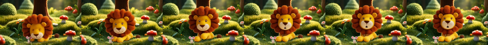
- 2026-09-26: Scene 2 v2 seed 5202: tracking camera moved, Milo stayed on the
  spot (Rule 2.10 revised to a fixed camera). Seed 5203 the same: no run; the
  camera arced round him and invented a red-barked tree (Rules 2.8b, 2.11).
- 2026-09-26: LoRA A/B (s03_leo_wakes_lora 5301, s02_milo_runs_v2_lora 5202):
  with LoRAs the location drifted away from the keyframe (new canopy, another
  forest) and identity was no better. Shots stay without LoRAs.
- 2026-09-26: Scene 6 (fixed camera): Leo walks across the frame, both seeds.
  Scene 7: the whole-body turn to camera works (7101); the run leaves the
  frame diagonally (7201). Rule 2.10's fixed-camera version confirmed for
  walking. Scene 2 v3 re-tests the run on the clearing keyframe.
- 2026-09-26: Scene 4: "Leo's face softens into a big warm smile and he nods"
  worked (4202: expression changes register when they are the whole shot);
  4201 turned his head down towards Milo instead (eye-line right, no smile).
  Both "push in on Milo" renders pushed in on Leo (Rule 2.12).
- 2026-09-26: Scene 2 v3 (fixed camera): Milo runs left out of the frame in
  both seeds (5204, 5205). **Rule 2.10's fixed-camera version confirmed for
  running.** Scene 6 net (first prop event): 6202 the net drops and drapes
  over Leo, matching the design picked from its sheet; 6201 the net just
  appeared in a pile beside him. A prop described by its sheet in the action
  line comes out on-model.

  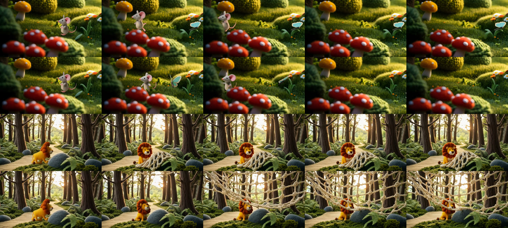
- 2026-09-26: Scene 4 v2 (close-up crop of the continuity frame): Milo pleads,
  both seeds (Rule 2.12 fix confirmed). Scene 5: "Milo turns and scampers away
  out of the left edge; Leo stays lying down, watching with a smile" worked in
  5501 (a tiny character's big whole-body move reads even when small, unlike a
  gesture). Rows: plead 4103, plead 4104, leaves 5501, leaves 5502.

  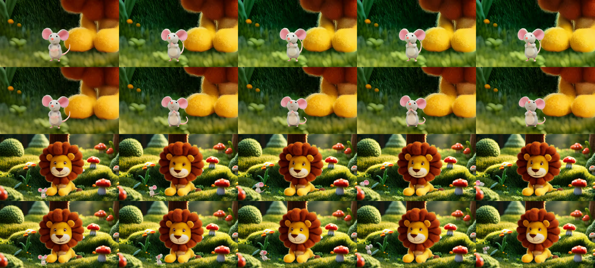
- 2026-09-26: Scene 6 call for help: "calls out loudly, mouth in a big round O,
  worried but not scared" gave a mild cartoon call (6302); 6301 pushed into the
  net with rope over his face, which reads as struggling (not used: findings
  B6). Scene 8 arrival from a wide frame: Milo (1/10 of the frame, at the edge)
  barely moved in both seeds (Rule 2.12 again); v2 uses a close-up crop.

  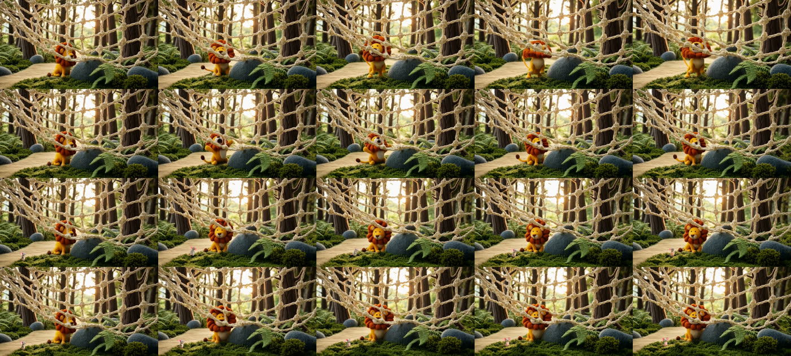
- 2026-09-27 (v2 cast): pose clips from the owner's canonicals. Milo paws
  together and Milo worried: clean, on-model. Leo lying down: on-model, but
  **his big glossy cartoon eyes never closed** ("gently closes his eyes" in the
  action and "open eyes" in the negative) and "lies awake" ended sitting with
  paw pads to the camera. Eyes this large seem to resist closing without an
  image that shows them closed; round 2 tries closing the eyes as the whole
  shot, from the lying frame. An owner-made "Leo asleep" still would settle it.

  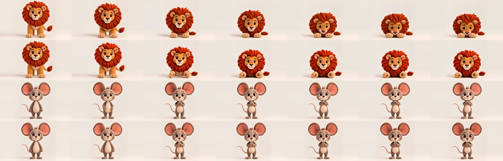
- 2026-09-27 (v2): **Rule 2.1 again, for faces: split a pose change and a face
  change into two shots.** "Lie down and close the eyes" kept the eyes open;
  starting from the lying frame, "Leo slowly closes his big eyes and falls
  asleep" as the whole shot closed them cleanly (seed 2711; seed 2712 turned the
  eyes into yellow discs, so two seeds). "Lies down like a sphinx, both front
  paws flat on the floor and pointing forward" fixed the paw-pads-up pose.
  Rows: closes eyes a, b; sphinx a, b.

  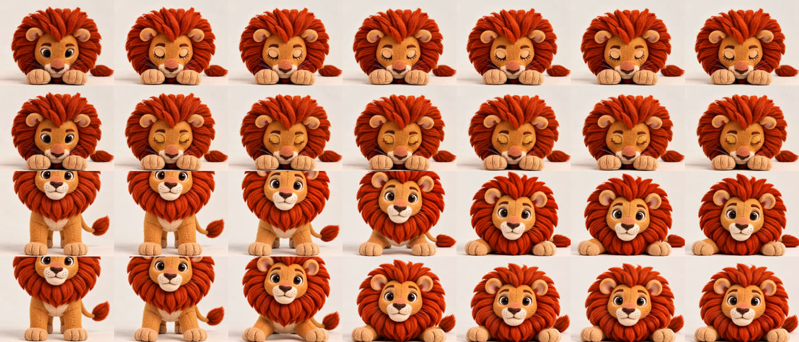
- 2026-09-27 (v2 Scenes 1-4): with the owner's cast every shot came out
  on-model. Scene 1 push-in, Leo stays asleep (both seeds). Scene 2 Milo runs
  past the sleeping Leo and out of frame (both seeds; fixed camera). Scene 3
  **start + end keyframes** (Leo asleep -> Leo lying awake, same place): Leo
  woke, swung a paw down beside Milo and landed on the end pose (3101).
  Scene 4 Leo softens with `background:` instead of the location sheet: the
  background stayed soft in both seeds (Rule 2.13 fix confirmed).

  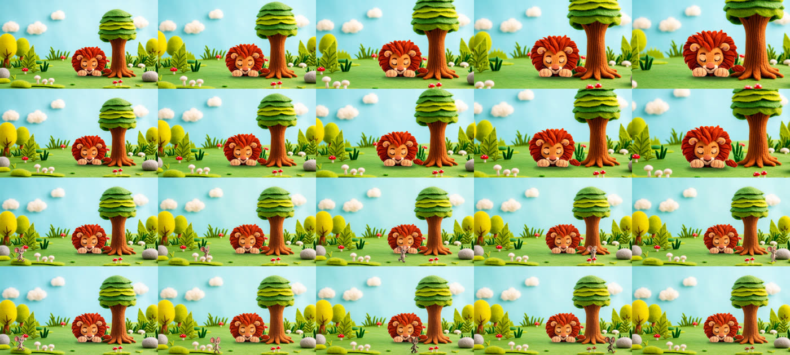
  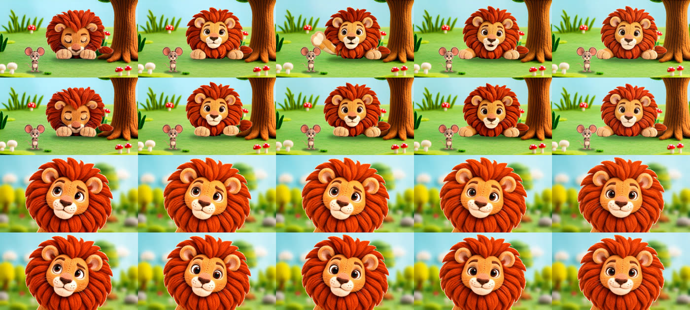
- 2026-09-27 (v2 Scenes 7-8): Leo walks the trap path across the frame (both
  seeds; fixed camera). Milo's turn towards the sound pinned by start+end
  keyframes (3/4 view -> side view mirrored) landed exactly. Milo "runs very
  fast" starting from the owner's *walking* image walked off into depth: the
  start pose sets the gait. A run needs a running start still.

  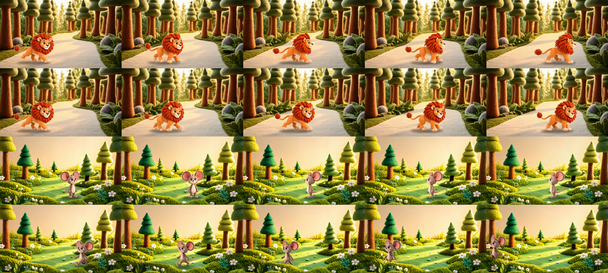
- 2026-09-27 (v2 Scenes 5-6): "Leo draws his big paw back towards himself"
  lifted the paw up to his face in both seeds: a direction relative to the
  body is ambiguous. Say where the paw stays or goes in the frame ("keeps his
  paws resting flat on the grass"). Scene 6 thank-you with start+end keyframes
  (worried -> paws together): clean in both seeds.

  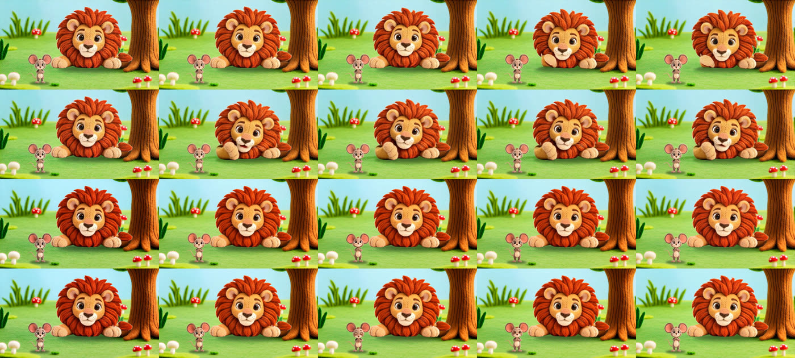
- 2026-09-27 (v2, fast mode): 3/4 Leo in Scenes 1-3: identity and pose held;
  one seed in three woke Leo at the end (1113, 2113); Scene 3 3112 wakes with
  a paw forward. Scene 7 tug: 7303 calm; 7301/7302 opened the mouth. Scenes
  5/6 continuation shots drifted (Rule 2.14).
- 2026-09-27 (v2, fast mode, end keyframes): Rule 2.14 confirmed. With an end
  keyframe, Scene 5 (nod, 5106) and Scene 6 (Milo leaves, 6305) kept the
  framing in all seeds; without one, the Scene 10 gnaw close-up drifted back
  into a new forest in all three seeds (v2 re-rendered with the end pinned).
  Leo stepping free of the net (start: trapped; end: standing free, composed)
  worked in all seeds: the net slid away on its own. Close-ups from the
  expression set (Scenes 9, 11) clean in every seed.
- 2026-09-27: Scene 10 gnaw v2, end keyframe = start keyframe: the framing
  held in all seeds, but Milo stood still at the rope in all three. An end
  frame identical to the start pins the action too; for an action that must
  change the scene (a rope parting), the end keyframe must show the result.

- **2026-10-05, Lion and Mouse v5 (186 fast clips, `stories/lion_and_mouse_v5/RENDER_REVIEW.md`).**
  Owner-made start and end images held identity in every clip, and the net fall and the walk
  out of the net worked in all takes. Close-up prompts that named absent things ("the overhead
  branch stays empty", "paws and tail stay outside the portrait") made Wan draw them: a
  branch and leaves over the heads and paws rising into frame in most S15 takes. With fast
  mode's CFG 1 there is no negative pass, so a named object is a requested object: describe
  only what is in frame.
